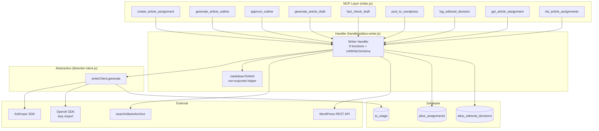
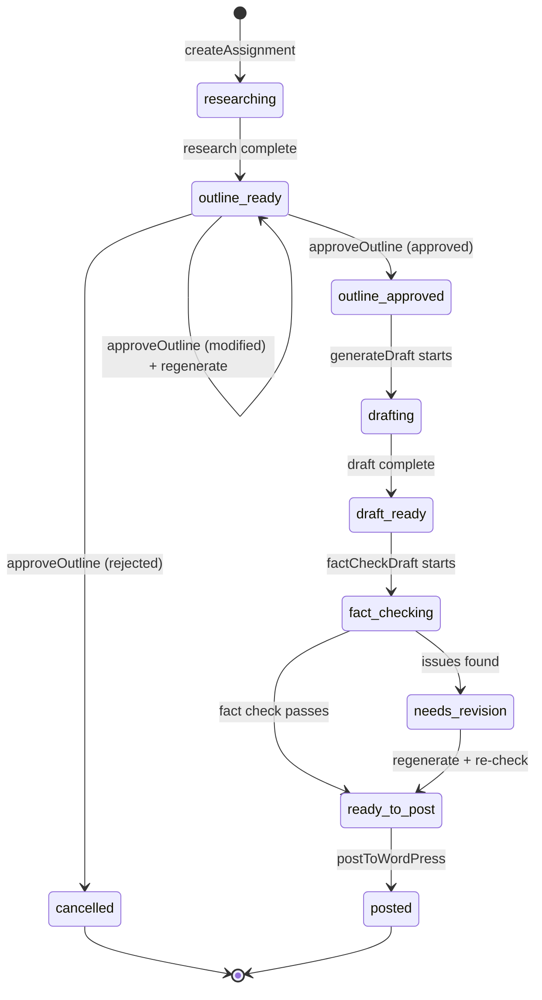

# Design Document: Altus AI Writer Pipeline

## Overview

The AI Writer pipeline adds a multi-step content generation workflow to the Altus MCP server, enabling Derek (via Hal) to assign article topics and have AI produce researched, outlined, drafted, fact-checked, and WordPress-posted content — all with human-in-the-loop editorial control.

The pipeline introduces:
- **`lib/writer-client.js`** — a unified AI generation abstraction supporting Anthropic and OpenAI, controlled by `ALTUS_WRITER_MODEL` env var
- **`handlers/altus-writer.js`** — pipeline business logic with 9 exported handler functions + `initWriterSchema`
- **Two new database tables** — `altus_assignments` (pipeline state) and `altus_editorial_decisions` (decision audit log)
- **9 MCP tools** registered in `index.js`
- **2 REST endpoint updates** migrating from `agent_memory` to `altus_assignments`

The design follows all established Altus patterns: ESM imports, Zod schemas, `safeToolHandler()` wrapping, `TEST_MODE` intercepts, `DATABASE_URL` guards, `altus_` table prefix, and `initSchema` at startup.

## Architecture



### Pipeline Status Flow



### Key Design Decisions

1. **Writer Client as abstraction layer**: The handler never touches Anthropic or OpenAI SDKs directly. Switching providers is a one-line env var change (`ALTUS_WRITER_MODEL=gpt-4o`). Cost logging is handled inside `generate()`, keeping the handler clean.

2. **OpenAI lazy import**: The `openai` package is imported inside `generate()` only when needed, preventing startup crashes when `OPENAI_API_KEY` is absent (the common case — Anthropic is the default).

3. **Promise.allSettled for research**: Archive and web research run in parallel. One failing doesn't block the other or crash assignment creation. Null is stored for any failed research source.

4. **Fact-check loop bounded to one iteration**: Initial check → regenerate flagged sections → re-check → stop. This prevents infinite regeneration cycles while still giving the pipeline one chance to self-correct.

5. **Draft-only WordPress posting**: The handler hardcodes `status: 'draft'` and accepts no parameter to override it. AI-generated content always requires human review in the WordPress editor.

6. **Markdown converter as non-exported helper**: Simple regex-based conversion within the handler module. No external dependency. Covers headings, bold, italic, lists, links, and paragraphs — sufficient for WordPress draft content.

## Components and Interfaces

### Writer Client (`lib/writer-client.js`)

```javascript
/**
 * @param {Object} params
 * @param {string} params.toolName    - MCP tool name (for cost logging)
 * @param {string} params.system      - System prompt
 * @param {string} params.prompt      - User message
 * @param {number} [params.maxTokens=4000] - Max output tokens
 * @param {boolean} [params.webSearch=false] - Enable web search tool
 * @param {boolean} [params.jsonMode=false]  - Request JSON output
 * @returns {Promise<string>} Plain text response from the model
 */
export async function generate({ toolName, system, prompt, maxTokens, webSearch, jsonMode })
```

**Provider detection logic:**
- Read `ALTUS_WRITER_MODEL` env var (default: `claude-sonnet-4-5`)
- If model starts with `gpt-`, `o1`, or `o3` → OpenAI provider
- All other model names → Anthropic provider

**Anthropic path:**
- Import `@anthropic-ai/sdk` at module top level
- Web search: `tools: [{ type: 'web_search_20250305', name: 'web_search' }]`
- JSON mode: append `"\n\nRespond with valid JSON only."` to system prompt
- Extract text from `response.content[0].text`

**OpenAI path:**
- Lazy `import('openai')` inside `generate()` — never at top level
- Web search: `tools: [{ type: 'web_search_preview' }]`
- JSON mode: `response_format: { type: 'json_object' }`
- Extract text from `response.choices[0].message.content`

**Cost logging (both providers):**
- After every successful call: `logAiUsage(toolName, response.model, { input_tokens, output_tokens })`
- Normalize OpenAI's `prompt_tokens`/`completion_tokens` to `input_tokens`/`output_tokens`
- Cost logging failures are caught and logged, never propagated

**Error shape:**
- `throw new Error('writer-client [${provider}]: ${err.message}')`

### Writer Handler (`handlers/altus-writer.js`)

**Exported functions:**

| Function | Purpose | Status Transition |
|---|---|---|
| `initWriterSchema()` | Creates `altus_assignments` + `altus_editorial_decisions` tables | — |
| `createAssignment({ topic, article_type, review_notes_id })` | Insert + parallel research | → `researching` → `outline_ready` |
| `generateOutline({ assignment_id })` | AI outline generation (JSON mode) | `outline_ready` → `outline_ready` (outline stored) |
| `approveOutline({ assignment_id, decision, feedback })` | Editorial decision on outline | → `outline_approved` / `cancelled` / `outline_ready` |
| `generateDraft({ assignment_id })` | Full markdown draft generation | `outline_approved` → `draft_ready` |
| `factCheckDraft({ assignment_id })` | Fact check + optional regeneration loop | `draft_ready` → `ready_to_post` |
| `postToWordPress({ assignment_id, title, categories, tags })` | Markdown→HTML + WP draft post | `ready_to_post` → `posted` |
| `logEditorialDecision({ assignment_id, stage, decision, feedback })` | Insert decision record | — |
| `getAssignment({ id })` | Full row + joined decisions | — |
| `listAssignments({ status, article_type, limit, offset })` | Filtered summary list | — |

**Non-exported helpers:**
- `markdownToHtml(markdown)` — regex-based converter for headings, bold, italic, lists, links, paragraphs

**Import dependencies:**
- `pool` from `lib/altus-db.js`
- `logger` from `../logger.js`
- `generate` from `lib/writer-client.js`
- `searchAltwireArchive` from `handlers/altus-search.js` (direct function call, not MCP tool)
- `buildAuthHeader` from `lib/wp-client.js`

### MCP Tool Registration (index.js additions)

All 9 tools follow the established pattern:
```javascript
server.registerTool('tool_name', {
  description: '...',
  inputSchema: { /* Zod schema */ },
}, safeToolHandler(async (params) => {
  if (process.env.TEST_MODE === 'true') return { content: [{ type: 'text', text: JSON.stringify(mockData) }] };
  if (!process.env.DATABASE_URL) return { content: [{ type: 'text', text: JSON.stringify({ error: 'Database not configured' }) }] };
  const result = await handlerFunction(params);
  return { content: [{ type: 'text', text: JSON.stringify(result) }] };
}));
```

### REST Endpoint Updates (index.js HTTP server)

Two existing endpoints migrate from `agent_memory` queries to `altus_assignments`:

**`GET /hal/writer/assignments`** — List all assignments (summary fields only)
- Query `altus_assignments` with optional `status` and `article_type` query params
- Return `{ assignments: [...], count: N }`

**`GET /hal/writer/assignments/:id`** — Get assignment by ID with decisions
- Query `altus_assignments` by `id`, LEFT JOIN `altus_editorial_decisions`
- Return full assignment record with `decisions` array
- Return `{ assignment: null }` when not found

Both endpoints retain existing auth (`ALTUS_ADMIN_TOKEN` bearer), CORS, and OPTIONS preflight handling.

## Data Models

### `altus_assignments` Table

```sql
CREATE TABLE IF NOT EXISTS altus_assignments (
  id                SERIAL PRIMARY KEY,
  topic             TEXT NOT NULL,
  article_type      TEXT NOT NULL DEFAULT 'article'
                    CHECK (article_type IN ('article', 'review', 'interview', 'feature')),
  status            TEXT NOT NULL DEFAULT 'researching'
                    CHECK (status IN (
                      'researching', 'outline_ready', 'outline_approved',
                      'drafting', 'draft_ready', 'fact_checking',
                      'needs_revision', 'ready_to_post', 'posted', 'cancelled'
                    )),
  archive_research  JSONB,
  web_research      TEXT,
  review_notes_id   INTEGER REFERENCES altus_reviews(id) ON DELETE SET NULL,
  outline           JSONB,
  outline_notes     TEXT,
  draft_content     TEXT,
  draft_word_count  INTEGER,
  fact_check_results JSONB,
  wp_post_id        INTEGER,
  wp_post_url       TEXT,
  created_at        TIMESTAMPTZ NOT NULL DEFAULT NOW(),
  updated_at        TIMESTAMPTZ NOT NULL DEFAULT NOW()
);

CREATE INDEX IF NOT EXISTS altus_assignments_status_idx ON altus_assignments (status);
CREATE INDEX IF NOT EXISTS altus_assignments_created_idx ON altus_assignments (created_at);
```

**Outline JSONB shape:**
```json
{
  "title_suggestion": "string",
  "sections": [{ "title": "string", "points": ["string"] }],
  "angle": "string",
  "estimated_words": 1200
}
```

**Fact check results JSONB shape:**
```json
{
  "passed": true,
  "issues": [{ "section": "string", "issue": "string", "severity": "string" }]
}
```

### `altus_editorial_decisions` Table

```sql
CREATE TABLE IF NOT EXISTS altus_editorial_decisions (
  id              SERIAL PRIMARY KEY,
  assignment_id   INTEGER REFERENCES altus_assignments(id) ON DELETE SET NULL,
  stage           TEXT NOT NULL
                  CHECK (stage IN ('outline', 'draft', 'post', 'feedback')),
  decision        TEXT NOT NULL
                  CHECK (decision IN ('approved', 'rejected', 'modified', 'cancelled')),
  feedback        TEXT,
  article_type    TEXT,
  topic           TEXT,
  created_at      TIMESTAMPTZ NOT NULL DEFAULT NOW()
);

CREATE INDEX IF NOT EXISTS altus_editorial_decisions_assignment_idx
  ON altus_editorial_decisions (assignment_id);
```

### Zod Input Schemas (for MCP tool registration)

| Tool | Required Params | Optional Params |
|---|---|---|
| `create_article_assignment` | `topic: z.string()` | `article_type: z.enum([...]).default('article')`, `review_notes_id: z.number().int().optional()` |
| `generate_article_outline` | `assignment_id: z.number().int()` | — |
| `approve_outline` | `assignment_id: z.number().int()`, `decision: z.enum(['approved','rejected','modified'])` | `feedback: z.string().optional()` |
| `generate_article_draft` | `assignment_id: z.number().int()` | — |
| `fact_check_draft` | `assignment_id: z.number().int()` | — |
| `post_to_wordpress` | `assignment_id: z.number().int()` | `title: z.string().optional()`, `categories: z.array(z.string()).optional()`, `tags: z.array(z.string()).optional()` |
| `log_editorial_decision` | `assignment_id: z.number().int()`, `stage: z.enum([...])`, `decision: z.enum([...])` | `feedback: z.string().optional()` |
| `get_article_assignment` | `id: z.number().int()` | — |
| `list_article_assignments` | — | `status: z.string().optional()`, `article_type: z.string().optional()`, `limit: z.number().int().min(1).max(50).optional()`, `offset: z.number().int().optional()` |


## Correctness Properties

*A property is a characteristic or behavior that should hold true across all valid executions of a system — essentially, a formal statement about what the system should do. Properties serve as the bridge between human-readable specifications and machine-verifiable correctness guarantees.*

### Property 1: Markdown to HTML conversion preserves content

*For any* markdown string containing headings (`#`, `##`, `###`), bold (`**text**`), italic (`*text*`), unordered lists (`- item`), ordered lists (`1. item`), links (`[text](url)`), and paragraph breaks (double newlines), the `markdownToHtml` function SHALL produce HTML output that contains the original text content wrapped in the corresponding HTML tags (`<h1>`–`<h3>`, `<strong>`, `<em>`, `<ul><li>`, `<ol><li>`, `<a href>`, `<p>`).

**Validates: Requirements 17.1, 17.2, 17.3, 17.4, 17.5, 17.6, 17.7**

### Property 2: Provider detection routes correctly by model name

*For any* model name string, the Writer_Client provider detection SHALL route to OpenAI when the model name starts with `gpt-`, `o1`, or `o3`, and SHALL route to Anthropic for all other model names. The default model when `ALTUS_WRITER_MODEL` is unset SHALL be `claude-sonnet-4-5` (Anthropic).

**Validates: Requirements 15.2, 15.3**

### Property 3: Writer_Client generate returns plain string and logs cost

*For any* successful `generate()` call with valid parameters, the Writer_Client SHALL return a value of type `string` (never an object, array, or undefined), and SHALL call `logAiUsage` exactly once with the caller's `toolName`, the model from the API response, and normalized token counts.

**Validates: Requirements 15.10, 15.11, 16.1, 16.2**

### Property 4: Writer_Client error shape is consistent

*For any* API error thrown by either the Anthropic or OpenAI SDK during a `generate()` call, the Writer_Client SHALL catch and rethrow with the format `'writer-client [${provider}]: ${originalMessage}'` where `provider` is either `'anthropic'` or `'openai'`.

**Validates: Requirements 15.12**

### Property 5: Status guards reject wrong-state calls

*For any* assignment whose status is not the required precondition, the handler functions SHALL return an error object without modifying the assignment. Specifically: `generateOutline` requires `outline_ready`; `approveOutline` requires `outline_ready`; `generateDraft` requires `outline_approved`; `factCheckDraft` requires `draft_ready` or `needs_revision`; `postToWordPress` requires `ready_to_post`.

**Validates: Requirements 4.6, 5.7, 6.8, 7.8, 8.8**

### Property 6: approveOutline decision maps to correct status

*For any* valid `approveOutline` call on an assignment with status `outline_ready`, the decision parameter SHALL map to the correct resulting status: `approved` → `outline_approved`, `rejected` → `cancelled`, `modified` → `outline_ready` (with feedback stored in `outline_notes`).

**Validates: Requirements 5.1, 5.2, 5.3, 5.4**

### Property 7: Fact-check loop is bounded to at most 3 generate calls

*For any* `factCheckDraft` invocation, the handler SHALL call `writerClient.generate()` at most 3 times: one initial fact-check, one optional regeneration of flagged sections, and one optional re-check. The assignment status SHALL always end at `ready_to_post` regardless of the re-check outcome.

**Validates: Requirements 7.5, 18.1, 18.2, 18.3**

### Property 8: WordPress posting always creates drafts

*For any* `postToWordPress` call, the WordPress REST API request body SHALL always contain `status: 'draft'`. No parameter accepted by the tool SHALL be capable of overriding this to `publish`, `pending`, `private`, or any other WordPress post status.

**Validates: Requirements 8.4, 19.1, 19.2**

### Property 9: Word count matches draft content

*For any* generated draft, the `draft_word_count` stored on the assignment SHALL equal the number of whitespace-delimited words in the `draft_content` string.

**Validates: Requirements 6.5**

### Property 10: Editorial decisions capture assignment context

*For any* editorial decision logged (via `approveOutline` or `logEditorialDecision`), the decision record SHALL contain the `article_type` and `topic` values copied from the referenced assignment, along with the correct `stage` and `decision` values.

**Validates: Requirements 5.6, 9.1, 9.4**

### Property 11: listAssignments filter correctness and field exclusion

*For any* `listAssignments` call with a `status` or `article_type` filter, all returned assignments SHALL match the filter criteria. The response SHALL never include the large fields `archive_research`, `web_research`, `outline`, `draft_content`, or `fact_check_results`.

**Validates: Requirements 11.2, 11.3, 11.4, 11.5**

### Property 12: getAssignment returns decisions in chronological order

*For any* assignment with one or more editorial decisions, `getAssignment` SHALL return all associated decisions in the `decisions` array, ordered by `created_at` ascending.

**Validates: Requirements 10.1, 10.2**

### Property 13: createAssignment transitions through researching to outline_ready

*For any* valid `createAssignment` call with a topic and optional article_type, the handler SHALL insert a row with status `researching`, execute parallel research via `Promise.allSettled`, and update the status to `outline_ready` regardless of individual research call outcomes.

**Validates: Requirements 3.1, 3.6, 14.1, 14.6**

## Error Handling

### Writer_Client Errors
- API call failures are caught and rethrown with consistent shape: `'writer-client [${provider}]: ${message}'`
- `logAiUsage` failures are caught, logged via `logger.error`, and never propagated — cost tracking never blocks pipeline operations
- OpenAI lazy import failure (missing package) throws a clear error at generate-time, not at module load

### Handler Errors
- Every handler function checks assignment existence first — returns `{ error: 'assignment_not_found', assignment_id }` for missing records
- Every pipeline-step handler validates the current status — returns `{ error: 'assignment_not_ready_for_*', status }` for wrong-state calls
- `Promise.allSettled` in `createAssignment` ensures one research failure doesn't block the other — failed research stores `null` and logs via `logger.error`
- WordPress API failures in `postToWordPress` return `{ error: 'wordpress_post_failed', message }` without changing assignment status
- Markdown conversion errors are contained within the handler — malformed markdown produces best-effort HTML

### MCP Tool Layer Errors
- All tools wrapped in `safeToolHandler()` — unexpected exceptions return `{ exit_reason: 'tool_error' }` instead of crashing the transport
- `TEST_MODE=true` intercepts return representative mock data without touching DB or APIs
- Missing `DATABASE_URL` returns `{ error: 'Database not configured' }` immediately

### REST Endpoint Errors
- Database query failures return HTTP 500 with `{ error: 'query_failed', message: 'Writer data temporarily unavailable' }`
- Missing/invalid `ALTUS_ADMIN_TOKEN` returns HTTP 401 with `{ error: 'unauthorized' }`
- Assignment not found returns HTTP 200 with `{ assignment: null }` (not 404, matching existing pattern)

## Testing Strategy

### Property-Based Tests (fast-check)

The following properties will be tested using `fast-check` with a minimum of 100 iterations each. Test file: `tests/altus-writer.property.test.js`

| Property | What's Generated | What's Verified |
|---|---|---|
| P1: Markdown conversion | Random markdown strings with headings, bold, italic, lists, links | HTML output contains correct tags wrapping original text |
| P2: Provider detection | Random model name strings (including gpt-*, o1*, o3*, claude-*, random) | Correct provider selected |
| P3: generate() return type + cost logging | Mocked API responses with random token counts | Return is string, logAiUsage called once with correct args |
| P4: Error shape | Random error messages, both providers | Rethrown error matches format |
| P5: Status guards | Random statuses × handler functions | Wrong-state calls rejected, correct-state calls proceed |
| P6: approveOutline mapping | Random decisions (approved/rejected/modified) with random feedback | Correct status transition + outline_notes storage |
| P7: Fact-check loop bound | Mocked fact-check results (pass/fail sequences) | At most 3 generate() calls, always ends at ready_to_post |
| P8: WordPress draft-only | Random assignment content, titles, categories, tags | WP API body always has status: 'draft' |
| P9: Word count | Random draft strings | Stored count matches whitespace-split word count |
| P10: Editorial decision context | Random assignments with varying article_type/topic | Decision record matches assignment fields |
| P11: List filter + field exclusion | Random filter combinations, assignments with large fields | Filter correctness, no large fields in response |
| P12: Decision ordering | Assignments with multiple decisions at random timestamps | Decisions returned in created_at ascending order |
| P13: createAssignment flow | Random topics, article_types, research success/failure combos | Always transitions to outline_ready |

Each test tagged: `// Feature: altus-ai-writer, Property N: description`

### Unit Tests (Vitest)

Test file: `tests/altus-writer.unit.test.js`

Focus areas (specific examples and edge cases, not covered by property tests):
- `TEST_MODE=true` returns mock data for each tool
- `DATABASE_URL` not set returns error for each tool
- Assignment not found returns correct error shape
- `createAssignment` with and without `review_notes_id`
- `generateOutline` includes review notes in prompt when `review_notes_id` present
- `generateDraft` includes review notes as product observations
- `factCheckDraft` with no issues (single call, ready_to_post)
- `factCheckDraft` with issues (regenerate + re-check flow)
- `postToWordPress` stores wp_post_id and wp_post_url
- `postToWordPress` logs editorial decision with stage=post
- WordPress API failure doesn't change assignment status
- `listAssignments` with no matches returns `{ assignments: [], count: 0 }`
- REST endpoint auth rejection (missing/invalid token)
- REST endpoint assignment not found returns `{ assignment: null }`
- OpenAI lazy import (verify no top-level instantiation)
- `logAiUsage` failure in Writer_Client doesn't block generate()

### Integration Tests

- REST `GET /hal/writer/assignments` reads from `altus_assignments` (not `agent_memory`)
- REST `GET /hal/writer/assignments/:id` returns full record with joined decisions
- Full pipeline smoke test: create → outline → approve → draft → fact-check → post (with mocked AI)
