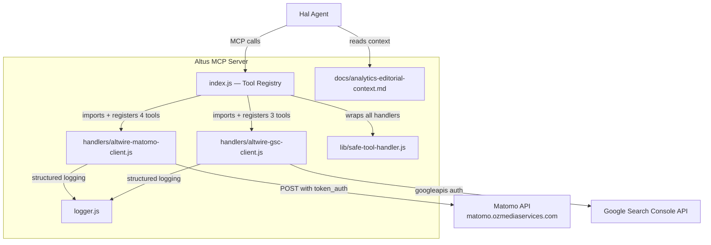

# Design Document: Altus Analytics

## Overview

This feature adds 7 MCP tools to the Altus server — 4 Matomo analytics tools and 3 Google Search Console tools — giving Hal visibility into AltWire's traffic, audience behavior, search performance, and editorial opportunities. The implementation copies proven handler patterns from cirrusly-nimbus, adapts them with `ALTWIRE_`-prefixed environment variables, and includes an editorial interpretation context file so Hal frames analytics through a music publication lens.

The design introduces two new handler modules (`handlers/altwire-matomo-client.js` and `handlers/altwire-gsc-client.js`), one new steering document (`docs/analytics-editorial-context.md`), and modifications to `index.js`, `package.json`, and `.env.example`.

## Architecture



### Key Design Decisions

1. **`server.registerTool()` not `server.tool()`** — Altus uses a different registration method than Nimbus. All 7 new tools follow the existing Altus pattern with Zod `inputSchema` objects (not positional schema args).

2. **`ALTWIRE_`-prefixed env vars** — Complete isolation from Nimbus. The Matomo client reads `ALTWIRE_MATOMO_URL`, `ALTWIRE_MATOMO_TOKEN_AUTH`, `ALTWIRE_MATOMO_SITE_ID`. The GSC client reads `ALTWIRE_GSC_SERVICE_ACCOUNT_JSON`, `ALTWIRE_GSC_SITE_URL`. This ensures both servers can run on the same Railway project without env var collisions.

3. **Standalone handler files** — No cross-repo imports. `altwire-matomo-client.js` and `altwire-gsc-client.js` are self-contained copies adapted from Nimbus, not shared modules.

4. **`safeToolHandler` without tool name arg** — Altus's `safeToolHandler` is a simpler wrapper than Nimbus's. It takes only the handler function (no tool name as second arg). All 7 tools use this existing wrapper.

5. **New `getSitemapHealth` function** — This doesn't exist in Nimbus. It's built from scratch using the GSC Sitemaps API (`google.webmasters.sitemaps.list`) and returns structured sitemap status data.

6. **`googleapis` dependency** — Must be added to `package.json` since Altus doesn't currently have it. The GSC client uses `googleapis` for service account auth and API calls.

7. **Logger import path** — Handler files in `handlers/` import logger via `../logger.js` (not `./logger.js` as Nimbus does, since Nimbus handlers live in the project root).

## Components and Interfaces

### 1. Matomo Client (`handlers/altwire-matomo-client.js`)

Adapted from `cirrusly-nimbus/matomo-client.js`. Uses `ALTWIRE_`-prefixed env vars.

**Internal function:**
```javascript
function getConfig()
// Returns { configured: true, url, token, siteId } or { configured: false, error: 'matomo_not_configured' }
// Reads: ALTWIRE_MATOMO_URL, ALTWIRE_MATOMO_TOKEN_AUTH, ALTWIRE_MATOMO_SITE_ID

async function callApi(method, period, date)
// POST-based Matomo Reporting API call with token_auth in body
// Returns parsed JSON or structured error object
```

**Exported functions:**
```javascript
export async function getTrafficSummary(period, date)
// Calls VisitsSummary.get → visits, unique visitors, pageviews, bounce rate

export async function getReferrerBreakdown(period, date)
// Calls Referrers.getReferrerType + Referrers.getWebsites + Referrers.getCampaigns

export async function getTopPages(period, date)
// Calls Actions.getPageUrls + Actions.getEntryPageUrls + Actions.getExitPageUrls

export async function getSiteSearch(period, date)
// Calls Actions.getSiteSearchKeywords + Actions.getSiteSearchNoResultKeywords
```

**Error handling pattern (all functions):**
- Missing env vars → `{ error: 'matomo_not_configured' }`
- HTTP non-200 → `{ error: 'matomo_api_error', status: <code> }`
- Non-JSON response → `{ error: 'matomo_invalid_response' }`
- Network failure → `{ error: 'matomo_request_failed', message: <detail> }`

### 2. GSC Client (`handlers/altwire-gsc-client.js`)

Adapted from `cirrusly-nimbus/gsc-client.js` with `ALTWIRE_`-prefixed env vars and a new `getSitemapHealth` function.

**Internal function:**
```javascript
function getConfig()
// Returns { configured: true, auth, siteUrl } or { configured: false, error: 'gsc_not_configured' }
// Reads: ALTWIRE_GSC_SERVICE_ACCOUNT_JSON, ALTWIRE_GSC_SITE_URL
// Parses service account JSON, creates GoogleAuth with webmasters.readonly scope
```

**Exported functions:**
```javascript
export function normalizeDimensions(dimensions)
// Pure function: converts string/array/falsy → string[] (default: ['query'])

export async function getSearchPerformance(startDate, endDate, options = {})
// searchanalytics.query → queries, impressions, clicks, CTR, position
// options: { rowLimit: 25, dimensions: ['query'] }

export async function getSearchOpportunities(startDate, endDate)
// searchanalytics.query sorted by impressions desc, filtered to high-impression + low-CTR

export async function getSitemapHealth()
// NEW — webmasters.sitemaps.list → sitemap URLs, lastDownloaded, lastSubmitted, isPending, errors, warnings
// Returns { sitemaps: [] } when no sitemaps registered (not an error)
```

**Error handling pattern (all async functions):**
- Missing env vars → `{ error: 'gsc_not_configured' }`
- Invalid service account JSON → log error + `{ error: 'gsc_not_configured' }`
- API failure → `{ error: 'gsc_api_error', message: <detail> }`

### 3. Tool Registrations (`index.js` additions)

All 7 tools follow the existing Altus `server.registerTool()` pattern:

| Tool Name | Handler | Parameters |
|---|---|---|
| `get_altwire_site_analytics` | `getTrafficSummary(period, date)` | `period`, `date` |
| `get_altwire_traffic_sources` | `getReferrerBreakdown(period, date)` | `period`, `date` |
| `get_altwire_top_pages` | `getTopPages(period, date)` | `period`, `date` |
| `get_altwire_site_search` | `getSiteSearch(period, date)` | `period`, `date` |
| `get_altwire_search_performance` | `getSearchPerformance(start, end, opts)` | `start_date`, `end_date`, `row_limit?`, `dimensions?` |
| `get_altwire_search_opportunities` | `getSearchOpportunities(start, end)` | `start_date`, `end_date` |
| `get_altwire_sitemap_health` | `getSitemapHealth()` | *(none)* |

Registration pattern (matching existing Altus style):
```javascript
server.registerTool(
  'tool_name',
  {
    description: '...',
    inputSchema: { param: z.string().describe('...') },
  },
  safeToolHandler(async ({ param }) => {
    const result = await handlerFunction(param);
    return { content: [{ type: 'text', text: JSON.stringify(result) }] };
  })
);
```

### 4. Editorial Context (`docs/analytics-editorial-context.md`)

A steering document that Hal reads to interpret analytics data through a music publication lens. Contains reframing guidelines for:
- Bounce rate → content engagement signal (not conversion failure)
- Top pages → editorial resonance indicators (artists, genres, coverage types)
- Traffic sources → music community referrals, artist name searches, loyal reader direct traffic
- Site search → reader demand signals for coverage topics
- GSC opportunities → editorial gaps where search visibility exists but content needs strengthening

### 5. Dependency Addition (`package.json`)

```json
"googleapis": "^146.0.0"
```

### 6. Environment Variables (`.env.example`)

```dotenv
# Matomo Analytics (AltWire instance)
ALTWIRE_MATOMO_URL=            # e.g. https://matomo.ozmediaservices.com
ALTWIRE_MATOMO_TOKEN_AUTH=     # Matomo API token
ALTWIRE_MATOMO_SITE_ID=        # Matomo site ID for altwire.net

# Google Search Console (AltWire property)
ALTWIRE_GSC_SERVICE_ACCOUNT_JSON=  # Full JSON service account key (single line)
ALTWIRE_GSC_SITE_URL=              # e.g. https://altwire.net or sc-domain:altwire.net
```

## Data Models

No new database tables. All data flows through external APIs (Matomo, GSC) and is returned directly to the MCP caller as JSON.

### Matomo Response Shapes

**getTrafficSummary** returns the raw Matomo `VisitsSummary.get` response:
```typescript
{
  nb_visits: number;
  nb_uniq_visitors: number;
  nb_pageviews: number;
  bounce_rate: string;       // e.g. "45%"
  avg_time_on_site: number;  // seconds
  // ... additional Matomo fields
}
```

**getReferrerBreakdown** returns:
```typescript
{ types: MatomoResponse; websites: MatomoResponse; campaigns: MatomoResponse }
```

**getTopPages** returns:
```typescript
{ pageUrls: MatomoResponse; entryPages: MatomoResponse; exitPages: MatomoResponse }
```

**getSiteSearch** returns:
```typescript
{ keywords: MatomoResponse; noResultKeywords: MatomoResponse }
```

### GSC Response Shapes

**getSearchPerformance** returns:
```typescript
{
  startDate: string;
  endDate: string;
  dimensions: string[];
  rows: Array<{ keys: string[]; clicks: number; impressions: number; ctr: number; position: number }>;
}
```

**getSearchOpportunities** returns:
```typescript
{
  startDate: string;
  endDate: string;
  medianCtr: number;
  opportunities: Array<{ query: string; clicks: number; impressions: number; ctr: number; position: number }>;
}
```

**getSitemapHealth** returns:
```typescript
{
  siteUrl: string;
  sitemaps: Array<{
    path: string;
    lastDownloaded: string | null;
    lastSubmitted: string | null;
    isPending: boolean;
    errors: number;
    warnings: number;
  }>;
}
```

### Error Response Shape (all handlers)

```typescript
{ error: string; message?: string; status?: number }
```


## Correctness Properties

*A property is a characteristic or behavior that should hold true across all valid executions of a system — essentially, a formal statement about what the system should do. Properties serve as the bridge between human-readable specifications and machine-verifiable correctness guarantees.*

### Property 1: Matomo env var isolation and graceful degradation

*For any* combination of environment variable states where one or more of `ALTWIRE_MATOMO_URL`, `ALTWIRE_MATOMO_TOKEN_AUTH`, or `ALTWIRE_MATOMO_SITE_ID` is missing or empty, all four Matomo client functions (`getTrafficSummary`, `getReferrerBreakdown`, `getTopPages`, `getSiteSearch`) SHALL return `{ error: 'matomo_not_configured' }`. Furthermore, setting unprefixed `MATOMO_URL`, `MATOMO_TOKEN_AUTH`, or `MATOMO_SITE_ID` SHALL have no effect on the configured/not-configured determination.

**Validates: Requirements 1.2, 1.3**

### Property 2: Matomo API error handling never throws

*For any* Matomo API failure mode — non-200 HTTP status code, non-JSON response body, or network error with any error message — the Matomo client functions SHALL return a structured error object (containing an `error` field) and SHALL NOT throw an exception.

**Validates: Requirements 1.5, 1.6, 1.7**

### Property 3: GSC env var isolation and graceful degradation

*For any* combination of environment variable states where `ALTWIRE_GSC_SERVICE_ACCOUNT_JSON` is missing, empty, or contains invalid JSON, or where `ALTWIRE_GSC_SITE_URL` is missing or empty, all three GSC client functions (`getSearchPerformance`, `getSearchOpportunities`, `getSitemapHealth`) SHALL return `{ error: 'gsc_not_configured' }`. Setting unprefixed `GSC_SERVICE_ACCOUNT_JSON` or `GSC_SITE_URL` SHALL have no effect.

**Validates: Requirements 6.2, 6.3, 6.4**

### Property 4: GSC API error handling never throws

*For any* GSC API failure with any error message, the GSC client functions SHALL return `{ error: 'gsc_api_error', message: <detail> }` and SHALL NOT throw an exception.

**Validates: Requirements 6.6**

### Property 5: normalizeDimensions always returns a string array

*For any* input value (string, array, null, undefined, number, object, empty string), `normalizeDimensions` SHALL return a non-empty array of strings. For array inputs, it SHALL return the input as-is. For empty or falsy inputs, it SHALL return `['query']`. The function is pure — same input always produces the same output.

**Validates: Requirements 6.7**

### Property 6: Search opportunities filtering invariant

*For any* non-empty array of search analytics rows with varying impressions and CTR values, `getSearchOpportunities` SHALL return only rows where impressions are greater than or equal to the median impressions AND CTR is strictly less than the median CTR. The returned set SHALL be a subset of the input rows.

**Validates: Requirements 8.2**

## Error Handling

All error handling follows the same pattern established by the existing Altus handlers: return structured error objects, never throw.

### Layer 1: Environment Configuration Errors

Both handler modules check env vars at the start of every function call via `getConfig()`. If any required var is missing or malformed:
- Matomo: returns `{ error: 'matomo_not_configured' }`
- GSC: returns `{ error: 'gsc_not_configured' }`

No API calls are made. No exceptions are thrown.

### Layer 2: API-Level Errors

**Matomo** (uses `fetch` directly):
| Failure Mode | Error Object |
|---|---|
| Network error (DNS, timeout, connection refused) | `{ error: 'matomo_request_failed', message: err.message }` |
| HTTP non-200 | `{ error: 'matomo_api_error', status: response.status }` |
| Non-JSON response body | `{ error: 'matomo_invalid_response' }` |

**GSC** (uses `googleapis` client):
| Failure Mode | Error Object |
|---|---|
| Any API error (auth, quota, network) | `{ error: 'gsc_api_error', message: err.message }` |

### Layer 3: Tool Handler Wrapper

`safeToolHandler()` wraps every tool registration. If any unhandled exception escapes the handler (shouldn't happen given Layer 1+2), it catches and returns:
```json
{ "success": false, "exit_reason": "tool_error", "message": "An unexpected error occurred." }
```

### Partial Failure Handling

`getReferrerBreakdown`, `getTopPages`, and `getSiteSearch` each make multiple parallel API calls. If one sub-call fails, the handler logs a warning and returns the mixed result (some fields contain data, others contain error objects). This matches the Nimbus pattern and lets Hal present partial data rather than failing entirely.

## Testing Strategy

### Testing Framework

- **Unit tests**: Vitest (already configured in Altus)
- **Property tests**: Vitest + `fast-check` (add `fast-check` as dev dependency)
- **Test location**: `altwire-altus/tests/`

### Property-Based Tests (`tests/altus-analytics.property.test.js`)

Each correctness property maps to a single `fast-check` property test with minimum 100 iterations.

| Property | Test Description | Generator Strategy |
|---|---|---|
| P1: Matomo env isolation | Generate random subsets of 3 ALTWIRE_ vars + random unprefixed vars. Mock fetch. Verify config result. | `fc.record({ url: fc.option(fc.webUrl()), token: fc.option(fc.string()), siteId: fc.option(fc.string()) })` for both prefixed and unprefixed |
| P2: Matomo error handling | Generate random HTTP status codes (4xx/5xx), random non-JSON strings, random error messages. Mock fetch for each mode. | `fc.oneof(fc.integer({min:400,max:599}), fc.string(), fc.string())` |
| P3: GSC env isolation | Generate random subsets of 2 ALTWIRE_ vars + random unprefixed vars + random invalid JSON strings. | `fc.record({ json: fc.option(fc.oneof(fc.json(), fc.string())), url: fc.option(fc.webUrl()) })` |
| P4: GSC error handling | Generate random error messages. Mock googleapis to throw. | `fc.string()` |
| P5: normalizeDimensions | Generate random JS values: strings, arrays of strings, null, undefined, numbers, objects, empty string. | `fc.oneof(fc.string(), fc.array(fc.string()), fc.constant(null), fc.constant(undefined), fc.integer(), fc.constant(''))` |
| P6: Opportunities filter | Generate random arrays of `{ impressions, ctr }` rows. Run filter logic. Verify invariant. | `fc.array(fc.record({ impressions: fc.nat(), ctr: fc.float({min:0, max:1}) }), {minLength: 1})` |

Tag format: `// Feature: altus-analytics, Property N: <description>`

### Unit Tests (`tests/altus-analytics.unit.test.js`)

Focused on specific examples, wiring, and integration points:

- Matomo `getTrafficSummary` returns expected shape with mocked fetch (Req 2.4)
- Matomo `callApi` sends token_auth in POST body, not query string (Req 1.4)
- GSC `getSitemapHealth` returns `{ sitemaps: [] }` when API returns empty list (Req 9.4)
- GSC `getSearchPerformance` passes dimensions and rowLimit to API (Req 7.2)
- Module export verification: Matomo exports 4 functions, GSC exports 4 (3 + normalizeDimensions) (Req 1.1, 6.1)
- Editorial context file exists and contains required sections (Req 12.1–12.6)

### What's NOT Tested with PBT

- Tool registration wiring (SMOKE — verified by code review and example tests)
- Editorial context document content (EXAMPLE — string matching)
- `package.json` dependency presence (SMOKE)
- `.env.example` completeness (SMOKE)
- Matomo/GSC API response shapes (INTEGRATION — depends on external APIs)
- `safeToolHandler` wrapping (SMOKE — already tested in existing test suite)
