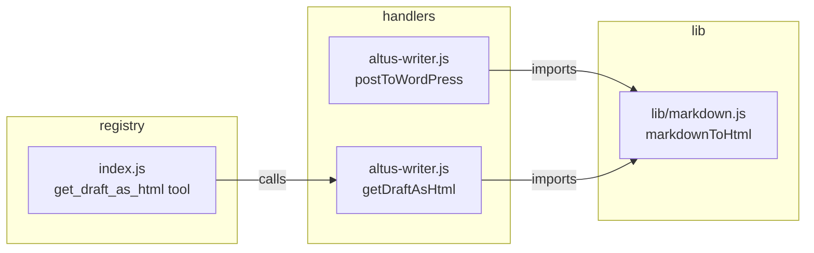

# Design Document: Altus HTML Export

## Overview

This feature extracts the existing inline `markdownToHtml` helper from `handlers/altus-writer.js` into a shared `lib/markdown.js` module and adds a new `get_draft_as_html` MCP tool. The tool lets Derek retrieve any drafted article as clean HTML for manual copy-paste into WordPress's Text/Code editor — an alternative to the automated `post_to_wordpress` flow.

The change is surgical: one function moves to a shared module, one new handler function is added, one new tool is registered. No new dependencies. No behavioral changes to existing functions.

## Architecture



The existing `postToWordPress` function currently calls an inline `markdownToHtml` helper. After extraction:

1. `lib/markdown.js` exports `markdownToHtml(markdown)` — the exact same function, moved verbatim.
2. `handlers/altus-writer.js` imports from `../lib/markdown.js` instead of defining it inline.
3. A new `getDraftAsHtml({ assignment_id })` export is added to the handler.
4. `index.js` registers `get_draft_as_html` following the established AI Writer tool pattern.

## Components and Interfaces

### lib/markdown.js

Single named export. No dependencies beyond built-in `String` and `RegExp`.

```javascript
/**
 * Convert markdown to HTML using inline regex replacements.
 * Handles: h1-h3, bold, italic, links, unordered lists, ordered lists, paragraphs.
 * @param {string|null} md - Markdown content
 * @returns {string} HTML string (empty string if input is null/empty)
 */
export function markdownToHtml(md) { /* exact copy of existing inline function */ }
```

### handlers/altus-writer.js — getDraftAsHtml

New exported function. Follows the same pattern as `getAssignment`.

```javascript
/**
 * @param {{ assignment_id: number }} params
 * @returns {Promise<object>} Success response with HTML or error object
 */
export async function getDraftAsHtml({ assignment_id }) {
  const assignment = await fetchAssignment(assignment_id);
  if (!assignment) return { error: 'assignment_not_found', assignment_id };
  if (!assignment.draft_content) return {
    error: 'no_draft_content',
    assignment_id,
    message: 'This assignment does not have a draft yet. Run generate_article_draft first.',
  };

  const outline = typeof assignment.outline === 'string'
    ? JSON.parse(assignment.outline) : assignment.outline;

  return {
    success: true,
    assignment_id: assignment.id,
    topic: assignment.topic,
    title_suggestion: outline?.title_suggestion || assignment.topic,
    html: markdownToHtml(assignment.draft_content),
    word_count: assignment.draft_word_count,
    instructions: 'Copy the html field and paste into WordPress → Text/Code editor. The title_suggestion is not included in the HTML — set it as the post title in WordPress.',
  };
}
```

### handlers/altus-writer.js — postToWordPress change

The only change to `postToWordPress` is the import source of `markdownToHtml`. The call site `markdownToHtml(assignment.draft_content)` remains identical. The inline function definition is deleted.

### index.js — Tool Registration

```javascript
import { ..., getDraftAsHtml } from './handlers/altus-writer.js';

server.registerTool(
  'get_draft_as_html',
  {
    description: 'Returns the article draft as clean HTML for copy-pasting into WordPress\'s Text/Code editor. Does not post to WordPress — just converts and returns the HTML. Available once a draft exists, regardless of pipeline status.',
    inputSchema: {
      assignment_id: z.number().int().positive().describe('Assignment ID'),
    },
  },
  safeToolHandler(async (params) => {
    if (process.env.TEST_MODE === 'true') return {
      content: [{ type: 'text', text: JSON.stringify({
        success: true, test_mode: true, assignment_id: params.assignment_id,
        topic: 'Test Topic', title_suggestion: 'Test Headline',
        html: '<h2>Test</h2><p>Draft content.</p>', word_count: 850,
        instructions: 'Copy the html field and paste into WordPress → Text/Code editor.',
      }) }],
    };
    if (!process.env.DATABASE_URL) return {
      content: [{ type: 'text', text: JSON.stringify({ error: 'Database not configured' }) }],
    };
    const result = await getDraftAsHtml(params);
    return { content: [{ type: 'text', text: JSON.stringify(result) }] };
  })
);
```

## Data Models

No schema changes. The feature reads from the existing `altus_assignments` table:

| Column | Type | Used by getDraftAsHtml |
|--------|------|----------------------|
| `id` | `SERIAL` | Lookup key |
| `topic` | `TEXT` | Returned in response |
| `outline` | `JSONB` | `.title_suggestion` extracted |
| `draft_content` | `TEXT` | Converted via `markdownToHtml` |
| `draft_word_count` | `INTEGER` | Returned in response |


## Correctness Properties

*A property is a characteristic or behavior that should hold true across all valid executions of a system — essentially, a formal statement about what the system should do. Properties serve as the bridge between human-readable specifications and machine-verifiable correctness guarantees.*

### Property 1: Markdown-to-HTML tag preservation

*For any* markdown string containing a mix of `##` headings, `**bold**`, `*italic*`, `[links](url)`, and `- list items`, `markdownToHtml` SHALL produce an HTML string containing the corresponding `<h2>`, `<strong>`, `<em>`, `<a href>`, and `<ul><li>` tags with the original text content preserved inside each tag.

**Validates: Requirements 1.2, 1.3, 1.4, 1.5, 1.6, 1.7**

### Property 2: Null and empty input safety

*For any* input that is `null`, `undefined`, or an empty string, `markdownToHtml` SHALL return an empty string `''`.

**Validates: Requirements 1.9**

### Property 3: Extraction equivalence (no-regression)

*For any* markdown string, the output of the extracted `lib/markdown.js` `markdownToHtml` function SHALL be byte-identical to the output of the original inline `markdownToHtml` function that was defined in `handlers/altus-writer.js`.

**Validates: Requirements 1.12, 4.3, 4.4**

### Property 4: getDraftAsHtml response shape completeness

*For any* assignment object that has non-null `draft_content`, `getDraftAsHtml` SHALL return an object containing all required fields: `success` (boolean), `assignment_id` (integer), `topic` (string), `title_suggestion` (string), `html` (string), `word_count` (integer), and `instructions` (string).

**Validates: Requirements 2.3**

### Property 5: No status gating on HTML export

*For any* assignment status value in the valid set (`researching`, `outline_ready`, `outline_approved`, `drafting`, `draft_ready`, `fact_checking`, `needs_revision`, `ready_to_post`, `posted`, `cancelled`), when the assignment has non-null `draft_content`, `getDraftAsHtml` SHALL return a success response — it SHALL NOT reject based on status.

**Validates: Requirements 2.5**

## Error Handling

| Condition | Response |
|-----------|----------|
| `assignment_id` not found in DB | `{ error: 'assignment_not_found', assignment_id }` |
| Assignment exists but `draft_content` is null | `{ error: 'no_draft_content', assignment_id, message: '...' }` |
| `DATABASE_URL` not set | `{ error: 'Database not configured' }` (guard in index.js) |
| `TEST_MODE=true` | Returns representative mock data, no DB call |
| `markdownToHtml` receives null/empty | Returns `''` (no error thrown) |

No new error types are introduced. The error shapes match the existing AI Writer handler conventions (`error` key + optional `message`).

## Testing Strategy

**Testing framework:** Vitest + fast-check (already in use across the project).

**Dual approach:**

- **Property-based tests** (`tests/markdown.property.test.js`): Validate Properties 1–5 using fast-check with minimum 100 iterations each. Generators produce random markdown strings with headings, bold, italic, links, and lists. Each test is tagged with `Feature: altus-html-export, Property N: description`.

- **Unit tests** (`tests/altus-html-export.unit.test.js`): Cover specific examples and edge cases:
  - `markdownToHtml` with a known markdown document → expected HTML (snapshot-style)
  - `getDraftAsHtml` with null `draft_content` → `no_draft_content` error
  - `getDraftAsHtml` with nonexistent `assignment_id` → `assignment_not_found` error
  - TEST_MODE mock response shape
  - DATABASE_URL guard

**Why PBT applies here:** `markdownToHtml` is a pure function with clear input/output behavior. The input space (all possible markdown strings) is large. Universal properties (tag preservation, null safety, extraction equivalence) hold across all valid inputs. fast-check generators can produce diverse markdown to exercise regex edge cases that hand-written examples would miss.

**Property test configuration:**
- Minimum 100 iterations per property
- Tag format: `Feature: altus-html-export, Property N: description`
- Each property test references its design document property number
