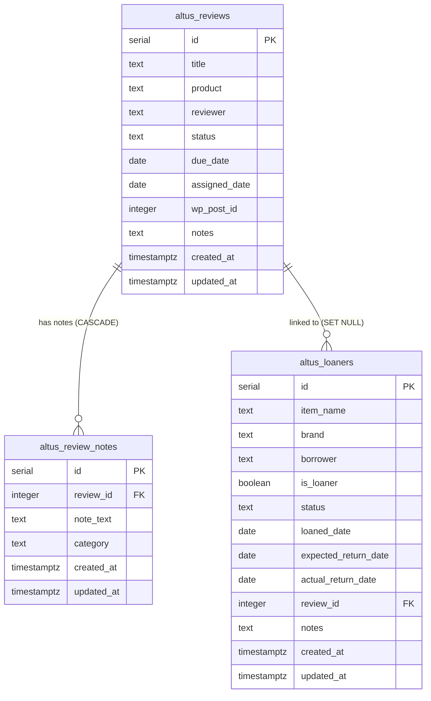

# Design Document: Altus Review & Loaner Tracker

## Overview

This feature adds review assignment tracking, loaner item management, and structured review note-taking to the Altus MCP server. It introduces three new PostgreSQL tables (`altus_reviews`, `altus_loaners`, `altus_review_notes`), one handler module (`handlers/review-tracker-handler.js`), and 16 new MCP tools — all following established Altus patterns.

The design is additive: no existing tools, tables, or handler modules are modified. The handler module consolidates all review, loaner, and note logic in a single file, importing the shared pool from `lib/altus-db.js`, the `logAiUsage` function from `lib/ai-cost-tracker.js`, and the Anthropic SDK for lightweight auto-categorization of review notes.

Key design decisions:
- Single handler module (`review-tracker-handler.js`) rather than splitting across multiple files — the feature is cohesive and the handler count stays manageable
- Direct Anthropic SDK usage (already a dependency) rather than raw `fetch` — consistent with how `lib/synthesizer.js` and other Altus modules call Claude
- Database-level cascade/orphan behavior via FK constraints rather than application-level logic — simpler, more reliable
- Dynamic overdue computation from date columns rather than relying on a `status` field — avoids stale status values

## Architecture

```mermaid
graph TD
    subgraph "index.js — Tool Registry"
        T1[altus_create_review]
        T2[altus_update_review]
        T3[altus_get_review]
        T4[altus_list_reviews]
        T5[altus_get_upcoming_review_deadlines]
        T6[altus_log_loaner]
        T7[altus_update_loaner]
        T8[altus_get_loaner]
        T9[altus_list_loaners]
        T10[altus_get_overdue_loaners]
        T11[altus_get_upcoming_loaner_returns]
        T12[altus_add_review_note]
        T13[altus_update_review_note]
        T14[altus_list_review_notes]
        T15[altus_delete_review_note]
        T16[altus_get_editorial_digest]
    end

    subgraph "handlers/review-tracker-handler.js"
        H[Handler Functions]
        SC[initReviewTrackerSchema]
        AC[autoCategorizNote — Haiku]
    end

    subgraph "Shared Libraries"
        DB[lib/altus-db.js — Pool]
        AI[lib/ai-cost-tracker.js — logAiUsage]
        STH[lib/safe-tool-handler.js]
        LOG[logger.js]
    end

    subgraph "PostgreSQL"
        R[(altus_reviews)]
        L[(altus_loaners)]
        N[(altus_review_notes)]
        AU[(ai_usage)]
    end

    subgraph "External"
        ANT[Anthropic API — Haiku 4.5]
    end

    T1 & T2 & T3 & T4 & T5 & T6 & T7 & T8 & T9 & T10 & T11 & T12 & T13 & T14 & T15 & T16 --> STH
    STH --> H
    H --> DB --> R & L & N
    AC --> ANT
    AC --> AI --> AU
    H --> LOG
end
```

### Startup Sequence

At server startup (when `DATABASE_URL` is set), `index.js` calls `initReviewTrackerSchema()` alongside the existing `initSchema()` and `initAiUsageSchema()` calls. This creates the three tables and their indexes idempotently using `CREATE TABLE IF NOT EXISTS` / `CREATE INDEX IF NOT EXISTS`.

### Request Flow

1. MCP client calls a tool (e.g., `altus_add_review_note`)
2. `index.js` routes through `safeToolHandler()` wrapper
3. Handler function in `review-tracker-handler.js` executes
4. For `addReviewNote` without a manual category: Haiku auto-categorization fires, cost is logged via `logAiUsage`, result falls back to `'uncategorized'` on any failure
5. Handler returns structured JSON; `index.js` wraps in MCP content format

## Components and Interfaces

### Handler Module: `handlers/review-tracker-handler.js`

All exported functions follow the same signature pattern: accept a params object, return a plain object (never throw — errors are returned as `{ error: string }`).

```javascript
// Imports
import pool from '../lib/altus-db.js';
import { logAiUsage } from '../lib/ai-cost-tracker.js';
import Anthropic from '@anthropic-ai/sdk';
import { logger } from '../logger.js';
```

#### Schema Initialization

```javascript
export async function initReviewTrackerSchema()
// Creates altus_reviews, altus_loaners, altus_review_notes tables
// Creates indexes on status, due_date, expected_return_date, review_id, category
// Uses CREATE TABLE IF NOT EXISTS / CREATE INDEX IF NOT EXISTS
// Called once at startup from index.js
```

#### Review Functions

```javascript
export async function createReview({ title, product, reviewer, status, due_date, wp_post_id, notes })
// → { review: <row> }

export async function updateReview({ review_id, title, product, reviewer, status, due_date, wp_post_id, notes })
// → { review: <row> } | { error: 'review_not_found', review_id }

export async function getReview({ review_id })
// → { review: <row> } | { error: 'review_not_found', review_id }

export async function listReviews({ status, reviewer })
// → { reviews: <rows>, count: <n> }

export async function getUpcomingReviewDeadlines({ days = 7 })
// → { reviews: <rows>, count: <n> } | { reviews: [], count: 0, note: '...' }
```

#### Loaner Functions

```javascript
export async function logLoaner({ item_name, brand, borrower, is_loaner, expected_return_date, review_id, notes })
// → { loaner: <row> }
// Business rule: is_loaner=false → status='kept', expected_return_date=NULL

export async function updateLoaner({ loaner_id, item_name, brand, borrower, is_loaner, status, expected_return_date, actual_return_date, review_id, notes })
// → { loaner: <row> } | { error: 'loaner_not_found', loaner_id }
// Business rules: is_loaner=false → status='kept', clear expected_return_date
//                 status='returned' + no actual_return_date → auto-set to CURRENT_DATE

export async function getLoaner({ loaner_id })
// → { loaner: <row> } | { error: 'loaner_not_found', loaner_id }

export async function listLoaners({ status, borrower })
// → { loaners: <rows>, count: <n> }

export async function getOverdueLoaners()
// → { loaners: <rows>, count: <n> }
// Dynamic: expected_return_date < CURRENT_DATE AND actual_return_date IS NULL
//          AND status NOT IN ('returned', 'kept', 'lost')

export async function getUpcomingLoanerReturns({ days = 14 })
// → { loaners: <rows>, count: <n> }
```

#### Review Note Functions

```javascript
export async function addReviewNote({ review_id, note_text, category })
// → { note: <row> }
// When category not provided: calls autoCategorizNote(), logs AI cost
// Falls back to 'uncategorized' on any failure

export async function updateReviewNote({ note_id, note_text, category })
// → { note: <row> } | { error: 'note_not_found', note_id }

export async function listReviewNotes({ review_id, category })
// → { notes: <rows>, count: <n> }

export async function deleteReviewNote({ note_id })
// → { deleted: true, note_id } | { error: 'note_not_found', note_id }
```

#### Digest Function

```javascript
export async function getEditorialDigest()
// → { review_pipeline: { <status>: <count> }, upcoming_deadlines: [...],
//     overdue_loaners: [...], loaner_summary: { <status>: <count> }, generated_at: <ISO> }
// Direct DB queries — does not call other handler functions
```

#### Internal Helper (not exported)

```javascript
async function autoCategorizNote(noteText)
// → { category: 'pro'|'con'|'observation'|'uncategorized', model, usage }
// Calls Haiku with system prompt: "You are a music gear review classifier..."
// Returns 'uncategorized' on any failure
```

### Tool Registry Additions (index.js)

Each of the 16 tools follows the established `server.registerTool()` pattern:

```javascript
import {
  initReviewTrackerSchema,
  createReview, updateReview, getReview, listReviews, getUpcomingReviewDeadlines,
  logLoaner, updateLoaner, getLoaner, listLoaners, getOverdueLoaners, getUpcomingLoanerReturns,
  addReviewNote, updateReviewNote, listReviewNotes, deleteReviewNote,
  getEditorialDigest,
} from './handlers/review-tracker-handler.js';

// At startup (alongside existing initSchema/initAiUsageSchema):
initReviewTrackerSchema().catch(err => logger.error('Review tracker schema init failed', { error: err.message }));

// Tool registration example:
server.registerTool(
  'altus_create_review',
  {
    description: 'Creates a new review assignment in the AltWire review pipeline...',
    inputSchema: {
      title: z.string().describe('Review title'),
      product: z.string().optional().describe('Product or topic being reviewed'),
      reviewer: z.string().default('Derek').optional().describe('Reviewer name'),
      status: z.enum(['assigned','in_progress','submitted','editing','scheduled','published','cancelled']).optional(),
      due_date: z.string().regex(/^\d{4}-\d{2}-\d{2}$/).optional().describe('ISO date YYYY-MM-DD'),
      wp_post_id: z.number().int().optional().describe('WordPress post ID if published'),
      notes: z.string().optional().describe('Free-form notes'),
    },
  },
  safeToolHandler(async (params) => {
    if (process.env.TEST_MODE === 'true') return { content: [{ type: 'text', text: JSON.stringify({ success: true, test_mode: true, review: { id: 1, title: params.title } }) }] };
    if (!process.env.DATABASE_URL) return { content: [{ type: 'text', text: JSON.stringify({ error: 'Database not configured' }) }] };
    const result = await createReview(params);
    return { content: [{ type: 'text', text: JSON.stringify(result) }] };
  })
);
```

All 16 tools follow this same structure with appropriate Zod schemas and TEST_MODE/DATABASE_URL guards.


## Data Models

### altus_reviews

| Column | Type | Constraints | Default |
|--------|------|-------------|---------|
| id | SERIAL | PRIMARY KEY | auto |
| title | TEXT | NOT NULL | — |
| product | TEXT | — | NULL |
| reviewer | TEXT | NOT NULL | 'Derek' |
| status | TEXT | NOT NULL, CHECK | 'assigned' |
| due_date | DATE | — | NULL |
| assigned_date | DATE | — | CURRENT_DATE |
| wp_post_id | INTEGER | — | NULL |
| notes | TEXT | — | NULL |
| created_at | TIMESTAMPTZ | NOT NULL | NOW() |
| updated_at | TIMESTAMPTZ | NOT NULL | NOW() |

Status CHECK constraint: `status IN ('assigned', 'in_progress', 'submitted', 'editing', 'scheduled', 'published', 'cancelled')`

Indexes: `status`, `due_date`

### altus_loaners

| Column | Type | Constraints | Default |
|--------|------|-------------|---------|
| id | SERIAL | PRIMARY KEY | auto |
| item_name | TEXT | NOT NULL | — |
| brand | TEXT | — | NULL |
| borrower | TEXT | NOT NULL | 'Derek' |
| is_loaner | BOOLEAN | NOT NULL | true |
| status | TEXT | NOT NULL, CHECK | 'out' |
| loaned_date | DATE | — | CURRENT_DATE |
| expected_return_date | DATE | — | NULL |
| actual_return_date | DATE | — | NULL |
| review_id | INTEGER | FK → altus_reviews(id) ON DELETE SET NULL | NULL |
| notes | TEXT | — | NULL |
| created_at | TIMESTAMPTZ | NOT NULL | NOW() |
| updated_at | TIMESTAMPTZ | NOT NULL | NOW() |

Status CHECK constraint: `status IN ('out', 'kept', 'returned', 'overdue', 'lost')`

Indexes: `status`, `expected_return_date`

FK behavior: Deleting a review sets `review_id` to NULL on associated loaners (orphan, not cascade).

### altus_review_notes

| Column | Type | Constraints | Default |
|--------|------|-------------|---------|
| id | SERIAL | PRIMARY KEY | auto |
| review_id | INTEGER | NOT NULL, FK → altus_reviews(id) ON DELETE CASCADE | — |
| note_text | TEXT | NOT NULL | — |
| category | TEXT | NOT NULL, CHECK | 'uncategorized' |
| created_at | TIMESTAMPTZ | NOT NULL | NOW() |
| updated_at | TIMESTAMPTZ | NOT NULL | NOW() |

Category CHECK constraint: `category IN ('pro', 'con', 'observation', 'uncategorized')`

Indexes: `review_id`, `category`

FK behavior: Deleting a review cascades to delete all associated notes.

### Entity Relationship



### DDL (initReviewTrackerSchema)

```sql
-- altus_reviews
CREATE TABLE IF NOT EXISTS altus_reviews (
  id            SERIAL PRIMARY KEY,
  title         TEXT NOT NULL,
  product       TEXT,
  reviewer      TEXT NOT NULL DEFAULT 'Derek',
  status        TEXT NOT NULL DEFAULT 'assigned'
                CHECK (status IN ('assigned','in_progress','submitted','editing','scheduled','published','cancelled')),
  due_date      DATE,
  assigned_date DATE DEFAULT CURRENT_DATE,
  wp_post_id    INTEGER,
  notes         TEXT,
  created_at    TIMESTAMPTZ NOT NULL DEFAULT NOW(),
  updated_at    TIMESTAMPTZ NOT NULL DEFAULT NOW()
);
CREATE INDEX IF NOT EXISTS altus_reviews_status_idx ON altus_reviews (status);
CREATE INDEX IF NOT EXISTS altus_reviews_due_date_idx ON altus_reviews (due_date);

-- altus_loaners
CREATE TABLE IF NOT EXISTS altus_loaners (
  id                   SERIAL PRIMARY KEY,
  item_name            TEXT NOT NULL,
  brand                TEXT,
  borrower             TEXT NOT NULL DEFAULT 'Derek',
  is_loaner            BOOLEAN NOT NULL DEFAULT true,
  status               TEXT NOT NULL DEFAULT 'out'
                       CHECK (status IN ('out','kept','returned','overdue','lost')),
  loaned_date          DATE DEFAULT CURRENT_DATE,
  expected_return_date DATE,
  actual_return_date   DATE,
  review_id            INTEGER REFERENCES altus_reviews(id) ON DELETE SET NULL,
  notes                TEXT,
  created_at           TIMESTAMPTZ NOT NULL DEFAULT NOW(),
  updated_at           TIMESTAMPTZ NOT NULL DEFAULT NOW()
);
CREATE INDEX IF NOT EXISTS altus_loaners_status_idx ON altus_loaners (status);
CREATE INDEX IF NOT EXISTS altus_loaners_return_date_idx ON altus_loaners (expected_return_date);

-- altus_review_notes
CREATE TABLE IF NOT EXISTS altus_review_notes (
  id         SERIAL PRIMARY KEY,
  review_id  INTEGER NOT NULL REFERENCES altus_reviews(id) ON DELETE CASCADE,
  note_text  TEXT NOT NULL,
  category   TEXT NOT NULL DEFAULT 'uncategorized'
             CHECK (category IN ('pro','con','observation','uncategorized')),
  created_at TIMESTAMPTZ NOT NULL DEFAULT NOW(),
  updated_at TIMESTAMPTZ NOT NULL DEFAULT NOW()
);
CREATE INDEX IF NOT EXISTS altus_review_notes_review_idx ON altus_review_notes (review_id);
CREATE INDEX IF NOT EXISTS altus_review_notes_category_idx ON altus_review_notes (category);
```

### Auto-Categorization Implementation

The `autoCategorizNote` internal function uses the Anthropic SDK (already a dependency):

```javascript
const anthropic = new Anthropic(); // uses ANTHROPIC_API_KEY from env

async function autoCategorizNote(noteText) {
  const VALID_CATEGORIES = ['pro', 'con', 'observation'];
  try {
    const response = await anthropic.messages.create({
      model: 'claude-haiku-4-5-20251001',
      max_tokens: 10,
      system: 'You are a music gear review classifier. Respond with exactly one word: pro, con, or observation.',
      messages: [{ role: 'user', content: `Classify this review note about a music product: "${noteText}"` }],
    });
    const raw = response.content?.[0]?.text?.trim().toLowerCase();
    const category = VALID_CATEGORIES.includes(raw) ? raw : 'uncategorized';
    return {
      category,
      model: response.model,
      usage: response.usage,
    };
  } catch (err) {
    logger.error('Auto-categorization failed', { error: err.message });
    return { category: 'uncategorized', model: 'claude-haiku-4-5-20251001', usage: { input_tokens: 0, output_tokens: 0 } };
  }
}
```

Cost tracking happens in `addReviewNote` after the categorization call:

```javascript
const catResult = await autoCategorizNote(note_text);
await logAiUsage('altus_add_review_note', catResult.model, catResult.usage);
```


## Correctness Properties

*A property is a characteristic or behavior that should hold true across all valid executions of a system — essentially, a formal statement about what the system should do. Properties serve as the bridge between human-readable specifications and machine-verifiable correctness guarantees.*

### Property 1: Review creation preserves input and applies defaults

*For any* valid title string, creating a review without specifying `reviewer` or `status` SHALL return a record where `title` matches the input, `reviewer` equals `'Derek'`, and `status` equals `'assigned'`.

**Validates: Requirements 5.1, 5.3, 5.4**

### Property 2: Loaner creation defaults and keeper business rule

*For any* valid item_name string, creating a loaner with `is_loaner=true` (or omitted) SHALL return a record where `item_name` matches the input, `borrower` equals `'Derek'`, and `status` equals `'out'`. Creating a loaner with `is_loaner=false` SHALL return a record where `status` equals `'kept'` and `expected_return_date` is NULL, regardless of any provided `expected_return_date` value.

**Validates: Requirements 10.1, 10.3, 10.4, 10.5, 22.1**

### Property 3: Review status validation rejects invalid values

*For any* string that is not one of the Review_Pipeline values (`assigned`, `in_progress`, `submitted`, `editing`, `scheduled`, `published`, `cancelled`), attempting to update a review's status to that string SHALL be rejected. *For any* valid pipeline status, the update SHALL succeed.

**Validates: Requirements 6.3**

### Property 4: Loaner returned status auto-sets actual_return_date

*For any* loaner in `'out'` status, updating its status to `'returned'` without providing `actual_return_date` SHALL result in `actual_return_date` being set to the current date. Updating with `is_loaner=false` SHALL set `status` to `'kept'` and `expected_return_date` to NULL.

**Validates: Requirements 11.3, 11.4, 22.2, 22.3**

### Property 5: List reviews filtering invariant

*For any* status filter value applied to `listReviews`, all returned reviews SHALL have a `status` matching that filter. *For any* reviewer filter value, all returned reviews SHALL have a `reviewer` matching that filter. When both filters are applied, all returned reviews SHALL match both.

**Validates: Requirements 8.3, 8.4**

### Property 6: List reviews ordering

*For any* set of reviews returned by `listReviews`, the results SHALL be ordered by `due_date` ascending with NULL values appearing last.

**Validates: Requirements 8.1**

### Property 7: Upcoming review deadlines filter and ordering

*For any* set of reviews and any positive integer N for the `days` parameter, `getUpcomingReviewDeadlines` SHALL return only reviews where `due_date` is not NULL, `due_date <= today + N days`, and `status` is not `'published'` or `'cancelled'`. Results SHALL be ordered by `due_date` ascending.

**Validates: Requirements 9.1, 9.3, 9.4**

### Property 8: List loaners filtering invariant

*For any* status filter value applied to `listLoaners`, all returned loaners SHALL have a `status` matching that filter. *For any* borrower filter value, all returned loaners SHALL have a `borrower` matching that filter.

**Validates: Requirements 13.3, 13.4**

### Property 9: List loaners ordering

*For any* set of loaners returned by `listLoaners`, the results SHALL be ordered by `loaned_date` descending.

**Validates: Requirements 13.1**

### Property 10: Overdue loaners dynamic computation

*For any* set of loaners, `getOverdueLoaners` SHALL return only loaners where `expected_return_date < CURRENT_DATE` AND `actual_return_date IS NULL` AND `status NOT IN ('returned', 'kept', 'lost')`. Results SHALL be ordered by `expected_return_date` ascending.

**Validates: Requirements 14.1, 14.2, 14.3**

### Property 11: Upcoming loaner returns filter

*For any* set of loaners and any positive integer N for the `days` parameter, `getUpcomingLoanerReturns` SHALL return only loaners where `expected_return_date` is within the next N days, `actual_return_date IS NULL`, and `status NOT IN ('kept', 'lost')`. Results SHALL be ordered by `expected_return_date` ascending.

**Validates: Requirements 15.1, 15.3**

### Property 12: Review notes category filter

*For any* category filter value applied to `listReviewNotes`, all returned notes SHALL have a `category` matching that filter.

**Validates: Requirements 18.3, 26.2**

### Property 13: Review notes chronological ordering

*For any* set of notes returned by `listReviewNotes`, the results SHALL be ordered by `created_at` ascending.

**Validates: Requirements 18.1, 26.3**

### Property 14: Editorial digest pipeline counts accuracy

*For any* set of reviews in the database, the `review_pipeline` object returned by `getEditorialDigest` SHALL contain counts that, when summed, equal the total number of reviews. Each status key's count SHALL equal the actual number of reviews with that status.

**Validates: Requirements 20.1**

## Error Handling

### Handler-Level Errors

All handler functions return error objects rather than throwing exceptions. The `safeToolHandler` wrapper in `lib/safe-tool-handler.js` catches any unexpected exceptions and returns a structured `{ exit_reason: 'tool_error' }` response.

| Error Condition | Response | Requirements |
|----------------|----------|--------------|
| `DATABASE_URL` not set | `{ error: 'Database not configured' }` | 5.6, 6.7, 7.4, 8.7, 9.7, 10.7, 11.8, 12.4, 13.7, 14.6, 15.6, 16.8, 17.6, 18.6, 19.4, 20.6 |
| Review not found by ID | `{ error: 'review_not_found', review_id: <id> }` | 6.5, 7.2, 16.6 |
| Loaner not found by ID | `{ error: 'loaner_not_found', loaner_id: <id> }` | 11.6, 12.2 |
| Note not found by ID | `{ error: 'note_not_found', note_id: <id> }` | 17.4, 19.2 |
| Invalid status value | PostgreSQL CHECK constraint rejects the INSERT/UPDATE | 1.2, 2.2, 3.2 |
| Empty result set | `{ <entity>: [], count: 0 }` with optional `note` field | 8.5, 9.5, 13.5, 14.4, 15.4, 18.4, 20.4 |

### Auto-Categorization Failure Handling

The `autoCategorizNote` function is designed to never block note creation:

1. If the Anthropic API call throws (network error, auth error, rate limit): catch, log via `logger.error`, return `'uncategorized'`
2. If the API response text is not one of `pro`, `con`, `observation`: return `'uncategorized'`
3. Cost tracking via `logAiUsage` happens regardless of categorization success (with zero tokens on failure)
4. The `addReviewNote` function always proceeds to INSERT the note after categorization completes or fails

### TEST_MODE Behavior

When `TEST_MODE=true`, all 16 tools return representative mock data without touching the database or calling the Anthropic API. This follows the established Altus pattern where write operations are safely intercepted in test/CI environments.

## Testing Strategy

### Property-Based Tests (fast-check)

Property-based tests validate the 14 correctness properties defined above. Each test runs a minimum of 100 iterations with randomly generated inputs.

- Library: `fast-check` (already in devDependencies)
- Test runner: Vitest (already configured)
- File: `tests/review-tracker.property.test.js`
- Tag format: `// Feature: altus-review-loaner-tracker, Property N: <title>`

The property tests focus on pure logic that can be tested without a database:
- Business rule functions (keeper logic, status validation, default application)
- Filtering and sorting invariants (using in-memory arrays to simulate query results)
- Date formatting and computation logic
- Digest aggregation logic

For properties that involve database queries (5–14), the tests will operate on in-memory arrays that simulate the query results, testing the filtering/sorting/aggregation logic extracted into testable pure functions.

### Unit Tests (Vitest)

- File: `tests/review-tracker.unit.test.js`
- Focus areas:
  - TEST_MODE mock responses for each tool
  - DATABASE_URL guard behavior
  - `autoCategorizNote` with mocked Anthropic SDK (success, failure, invalid response)
  - `addReviewNote` integration with auto-categorization (mocked)
  - Not-found error responses for each entity type
  - Edge cases: empty strings, null dates, boundary dates

### Integration Tests

Integration tests require a PostgreSQL instance and validate:
- Schema creation idempotency (`initReviewTrackerSchema` can run twice without error)
- FK cascade behavior (delete review → notes cascade, loaners orphaned)
- CHECK constraint enforcement (invalid status/category values rejected)
- Full CRUD round-trips for each entity

### Test Configuration

```javascript
// vitest.config.js — no changes needed, existing config supports new test files
// Property tests: minimum 100 iterations via { numRuns: 100 }
// Unit tests: standard Vitest assertions
```
