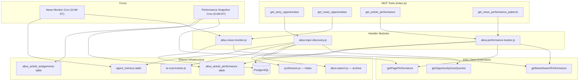

# Design Document: Altus Topic Discovery & News Intelligence

## Overview

This feature adds proactive editorial intelligence to the Altus MCP server — three connected capabilities that transform GSC data into actionable editorial guidance for Derek via Hal:

1. **Topic Discovery** — Cross-references GSC opportunity-zone queries (position 5–30) against the AltWire archive to surface story opportunities where search demand exists but coverage is thin. Uses Haiku to synthesize editorial pitches.
2. **Google News Monitoring** — Tracks GSC News search type data and cross-references with Derek's watch list to surface News coverage opportunities and alert on watch list activity.
3. **Post-Publish Performance Tracking** — Collects GSC performance snapshots at 72h, 7d, and 30d intervals after article publish, closing the editorial feedback loop.

The implementation is strictly additive — no existing V1 tool handlers or analytics tools are modified. New code lives in 3 new handler modules, 3 new GSC client functions, 1 new AI cost tracker module, 2 new crons, and 4 new MCP tool registrations in `index.js`.

## Architecture



### Data Flow — Topic Discovery

1. `get_story_opportunities` tool called → `altus-topic-discovery.js`
2. Check `agent_memory` for same-day cache → return if found
3. Call `getOpportunityZoneQueries()` for last 28 days of GSC data
4. For each query, call `searchAltwareArchive()` to check coverage
5. Score opportunities (impressions × position proximity × gap severity)
6. Call Haiku via synthesizer to generate 3–5 editorial pitches
7. Log Haiku call via `ai-cost-tracker.js`
8. Cache result in `agent_memory` with date-stamped key
9. Return structured response

### Data Flow — News Monitor Cron

1. Cron fires at 9 AM ET daily
2. Call `getNewsSearchPerformance()` for last 7 days
3. Query `altus_watch_list` for active watch items
4. Case-insensitive substring match News queries against watch list
5. Store alert in `agent_memory` with key `altus:news_alert:{YYYY-MM-DD}`
6. Log execution

### Data Flow — Performance Snapshot Cron

1. Cron fires at 6 AM ET daily
2. Query `altus_article_assignments` + `altus_article_performance` to find articles needing snapshots
3. For each article: call `getPagePerformance()` with GSC freshness-adjusted date range (end date = today - 2 days)
4. Upsert snapshot row into `altus_article_performance`
5. Log execution summary

## Components and Interfaces

### GSC Client Extensions (`handlers/altwire-gsc-client.js`)

Three new exported functions added to the existing GSC client module. All reuse the existing `getConfig()` helper and follow the same error-return pattern.

```javascript
/**
 * Fetch News search type performance data.
 * @param {string} startDate — ISO date
 * @param {string} endDate — ISO date
 * @param {{ rowLimit?: number, dimensions?: string[] }} options
 * @returns {Promise<{ startDate, endDate, rows: Array<{ keys, clicks, impressions, ctr, position }> } | { error: string }>}
 */
export async function getNewsSearchPerformance(startDate, endDate, options = {})

/**
 * Fetch queries in the opportunity zone (position 5–30).
 * @param {string} startDate — ISO date
 * @param {string} endDate — ISO date
 * @returns {Promise<{ startDate, endDate, rows: Array<{ keys, clicks, impressions, ctr, position }> } | { error: string }>}
 */
export async function getOpportunityZoneQueries(startDate, endDate)

/**
 * Fetch aggregate performance for a specific page URL.
 * @param {string} pageUrl — full URL (trailing slash stripped internally)
 * @param {string} startDate — ISO date
 * @param {string} endDate — ISO date
 * @returns {Promise<{ pageUrl, clicks, impressions, ctr, position } | { error: string }>}
 */
export async function getPagePerformance(pageUrl, startDate, endDate)
```

Key implementation details:
- `getNewsSearchPerformance` passes `searchType: 'news'` in the GSC API request body. Dimensions default to `['query']`.
- `getOpportunityZoneQueries` uses a `dimensionFilterGroups` filter for position >= 5 AND position <= 30, dimensions `['query', 'page']`, ordered by impressions descending, row limit 100.
- `getPagePerformance` uses a `dimensionFilterGroups` URL filter with `operator: 'equals'` on the normalized page URL. Returns aggregate metrics (no dimension breakdown).
- All three reuse `getConfig()` and return `{ error: 'gsc_not_configured' }` when env vars are missing.

### URL Normalization Utility

A shared `normalizeUrl(url)` function strips trailing slashes. Used by `getPagePerformance`, `altus-performance-tracker.js`, and `altus-topic-discovery.js`. Placed in the GSC client since that's where URL comparison is most critical.

```javascript
export function normalizeUrl(url) {
  if (typeof url !== 'string') return url;
  return url.replace(/\/+$/, '');
}
```

### Topic Discovery Handler (`handlers/altus-topic-discovery.js`)

```javascript
/**
 * Fetch story opportunities by cross-referencing GSC demand against archive coverage.
 * @param {{ days?: number }} params — lookback window (default 28)
 * @returns {Promise<object>}
 */
export async function getStoryOpportunities({ days = 28 } = {})
```

Internal flow:
1. Check `agent_memory` for cache key `altus:story_opportunities:{YYYY-MM-DD}`
2. Call `getOpportunityZoneQueries()` with computed date range
3. For each query row, call `searchAltwareArchive({ query: row.keys[0], limit: 3, content_type: 'all' })`
4. Classify as coverage gap if top `weighted_score < 0.50`
5. Score: `impressions * (1 - (position - 5) / 25) * gapMultiplier` where `gapMultiplier` = 1.5 for no coverage, 1.2 for weak coverage, 1.0 for covered
6. Sort by score descending, take top 10
7. Build Haiku prompt with top opportunities, call `synthesizePitches()` (new function in synthesizer.js)
8. Log via `logAiUsage('get_story_opportunities', response.model, response.usage)`
9. Cache in `agent_memory`, return result

### News Monitor Handler (`handlers/altus-news-monitor.js`)

```javascript
/**
 * Fetch News opportunities — GSC News data cross-referenced with watch list.
 * @returns {Promise<object>}
 */
export async function getNewsOpportunities()

/**
 * Run the daily news monitor check (called by cron).
 * Stores alert in agent_memory.
 * @returns {Promise<void>}
 */
export async function runNewsMonitorCron()
```

Internal flow for `getNewsOpportunities`:
1. Call `getNewsSearchPerformance()` for last 7 days with `['query']` dimension
2. Call `getNewsSearchPerformance()` for last 7 days with `['page']` dimension
3. Query `altus_watch_list` for active items (gracefully handle missing table)
4. Case-insensitive substring match: for each watch list item, check if any News query contains the item name
5. Return `{ news_queries, watch_list_matches, news_pages }`

### Performance Tracker Handler (`handlers/altus-performance-tracker.js`)

```javascript
/**
 * Get article performance snapshots.
 * @param {{ article_url?: string, snapshot_type?: string }} params
 * @returns {Promise<object>}
 */
export async function getArticlePerformance({ article_url, snapshot_type } = {})

/**
 * Get News performance patterns — which content types get News pickup.
 * @returns {Promise<object>}
 */
export async function getNewsPerformancePatterns()

/**
 * Register an article for post-publish tracking.
 * @param {{ articleUrl: string, wpPostId?: number, publishedAt?: string, sourceQuery?: string }} params
 * @returns {Promise<object>}
 */
export async function registerArticleForTracking({ articleUrl, wpPostId, publishedAt, sourceQuery })

/**
 * Run the daily performance snapshot collection (called by cron).
 * @returns {Promise<void>}
 */
export async function runPerformanceSnapshotCron()
```

### AI Cost Tracker (`lib/ai-cost-tracker.js`)

New module following the exact pattern from `cirrusly-mcp-server/ai-cost-tracker.js`, adapted for Altus:
- Imports `pool` from `../lib/altus-db.js` (not `./db.js`)
- Imports `logger` from `../logger.js`
- Exports `initAiUsageSchema()`, `logAiUsage(toolName, model, usage)`, `getAiCostSummary()`
- Same pricing table, same `calcCost()` logic
- `initAiUsageSchema()` called from `initSchema()` in `altus-db.js` or from the startup block in `index.js`

### Synthesizer Extension (`lib/synthesizer.js`)

New exported function added to the existing synthesizer:

```javascript
/**
 * Generate 3–5 editorial pitches from scored story opportunities.
 * @param {Array<{ query: string, impressions: number, position: number, score: number, coverageStatus: string }>} opportunities
 * @returns {Promise<{ pitches: string, model: string, usage: object }>}
 */
export async function synthesizePitches(opportunities)
```

Returns the raw Anthropic response metadata (`model`, `usage`) alongside the pitch text so the caller can pass it to `logAiUsage()`.

### Tool Registrations (`index.js`)

Four new `server.registerTool()` calls following the established pattern:

| Tool Name | Handler | Input Schema |
|---|---|---|
| `get_story_opportunities` | `getStoryOpportunities()` | `{ days?: z.number().int().min(7).max(90).default(28) }` |
| `get_news_opportunities` | `getNewsOpportunities()` | `{ days?: z.number().int().min(1).max(30).default(7) }` |
| `get_article_performance` | `getArticlePerformance()` | `{ article_url?: z.string(), snapshot_type?: z.enum(['72h','7d','30d']) }` |
| `get_news_performance_patterns` | `getNewsPerformancePatterns()` | `{ days?: z.number().int().min(7).max(90).default(30) }` |

All wrapped in `safeToolHandler()`. Each handler checks `TEST_MODE` and `DATABASE_URL` guards.

### Cron Registrations (`index.js`)

Two new cron schedules added to the `if (process.env.DATABASE_URL)` startup block:

```javascript
// News Monitor — 9 AM ET daily
cron.schedule('0 9 * * *', () => runNewsMonitorCron(), { timezone: 'America/New_York' });

// Performance Snapshot — 6 AM ET daily
cron.schedule('0 6 * * *', () => runPerformanceSnapshotCron(), { timezone: 'America/New_York' });
```

## Data Models

### New Table: `altus_article_performance`

```sql
CREATE TABLE IF NOT EXISTS altus_article_performance (
  id               SERIAL PRIMARY KEY,
  article_url      TEXT NOT NULL,
  wp_post_id       INTEGER,
  published_at     TIMESTAMPTZ,
  snapshot_type    TEXT NOT NULL,  -- '72h', '7d', '30d'
  snapshot_taken_at TIMESTAMPTZ DEFAULT NOW(),
  clicks           INTEGER DEFAULT 0,
  impressions      INTEGER DEFAULT 0,
  ctr              NUMERIC(5,4) DEFAULT 0,
  avg_position     NUMERIC(6,2),
  top_queries      JSONB DEFAULT '[]',
  source_query     TEXT,
  UNIQUE(article_url, snapshot_type)
);

CREATE INDEX IF NOT EXISTS altus_article_perf_published_idx
  ON altus_article_performance (published_at);
```

### New/Extended Table: `altus_article_assignments`

```sql
CREATE TABLE IF NOT EXISTS altus_article_assignments (
  id            SERIAL PRIMARY KEY,
  article_url   TEXT,
  wp_post_id    INTEGER,
  assigned_at   TIMESTAMPTZ DEFAULT NOW(),
  status        TEXT DEFAULT 'draft',
  source_query  TEXT
);

-- Safe column addition for existing tables
ALTER TABLE altus_article_assignments
  ADD COLUMN IF NOT EXISTS source_query TEXT;
```

### Existing Table Usage: `agent_memory`

The `agent_memory` table is shared across the platform (created by cirrusly-mcp-server). Altus writes to it with:
- `agent = 'altus'`
- `key = 'altus:story_opportunities:{YYYY-MM-DD}'` for topic discovery cache
- `key = 'altus:news_alert:{YYYY-MM-DD}'` for news monitor alerts
- `value` = JSON string of the cached result

Cache reads use: `SELECT value FROM agent_memory WHERE agent = 'altus' AND key = $1`
Cache writes use: `INSERT INTO agent_memory (agent, key, value) VALUES ($1, $2, $3) ON CONFLICT (agent, key) DO UPDATE SET value = EXCLUDED.value, updated_at = NOW()`

### Existing Table Usage: `ai_usage`

Created by `initAiUsageSchema()` in the new `lib/ai-cost-tracker.js`. Schema matches cirrusly-mcp-server exactly:
- `tool_name` — `'get_story_opportunities'`
- `model` — `'claude-haiku-4-5-20251001'`
- `input_tokens`, `output_tokens`, `estimated_cost_usd`

### Opportunity Scoring Algorithm

```
score = impressions × positionProximity × gapMultiplier

positionProximity = 1 - (position - 5) / 25
  // position 5 → 1.0, position 30 → 0.0

gapMultiplier:
  - 1.5 if no archive match (top weighted_score < 0.25)
  - 1.2 if weak match (top weighted_score 0.25–0.49)
  - 1.0 if covered (top weighted_score >= 0.50)
```

### Performance Snapshot Timing Logic

The cron identifies articles needing snapshots by comparing publish date against current date (minus GSC freshness lag of 2 days):

```
effectiveDate = today - 2 days (GSC freshness lag)

For '72h' snapshot:
  eligible if published_at <= effectiveDate - 72h
  AND no existing '72h' row in altus_article_performance

For '7d' snapshot:
  eligible if published_at <= effectiveDate - 7 days
  AND no existing '7d' row

For '30d' snapshot:
  eligible if published_at <= effectiveDate - 30 days
  AND no existing '30d' row
```

## Correctness Properties

*A property is a characteristic or behavior that should hold true across all valid executions of a system — essentially, a formal statement about what the system should do. Properties serve as the bridge between human-readable specifications and machine-verifiable correctness guarantees.*

### Property 1: URL normalization idempotence and equivalence

*For any* URL string, `normalizeUrl(url)` should not end with a `/` character, and `normalizeUrl(url + '/')` should equal `normalizeUrl(url)`. Additionally, applying `normalizeUrl` twice should produce the same result as applying it once (idempotence: `normalizeUrl(normalizeUrl(url)) === normalizeUrl(url)`).

**Validates: Requirements 3.3, 8.4, 12.4, 15.1, 15.2**

### Property 2: Opportunity scoring formula correctness

*For any* valid tuple of `(impressions, position, gapMultiplier)` where `impressions >= 0`, `5 <= position <= 30`, and `gapMultiplier` is one of `{1.0, 1.2, 1.5}`, the computed score should equal `impressions * (1 - (position - 5) / 25) * gapMultiplier`. The score should be non-negative, and a higher impressions count with the same position and gap should always produce a higher or equal score.

**Validates: Requirements 6.3**

### Property 3: Coverage gap classification threshold

*For any* archive search result set with a top `weighted_score`, the coverage gap classification should be: "no coverage" if `weighted_score < 0.25`, "weak coverage" if `0.25 <= weighted_score < 0.50`, and "covered" if `weighted_score >= 0.50`. The gap multiplier should be `1.5`, `1.2`, and `1.0` respectively.

**Validates: Requirements 6.2**

### Property 4: Case-insensitive substring watch list matching

*For any* News query string and watch list item string, the match function should return true if and only if the query (lowercased) contains the watch list item (lowercased) as a substring. The match result should be identical regardless of the original casing of either string.

**Validates: Requirements 7.2, 10.3**

### Property 5: Agent memory cache round-trip

*For any* valid JSON-serializable object, writing it to `agent_memory` with a date-stamped key and then reading it back with the same key should produce a value equal to the original object. Writing the same key twice with different values should result in only the latest value being stored (upsert). Reading a key for a different date should return no result.

**Validates: Requirements 6.6, 6.7, 13.1, 13.2, 13.3, 13.4, 10.4**

### Property 6: Snapshot eligibility date arithmetic

*For any* article with a known `published_at` timestamp and a set of existing snapshot types, the snapshot eligibility function should correctly identify missing snapshot types. An article is eligible for a '72h' snapshot if `published_at <= effectiveDate - 3 days` and no '72h' snapshot exists, eligible for '7d' if `published_at <= effectiveDate - 7 days` and no '7d' snapshot exists, and eligible for '30d' if `published_at <= effectiveDate - 30 days` and no '30d' snapshot exists, where `effectiveDate = today - 2 days`.

**Validates: Requirements 11.2, 11.4**

### Property 7: Article registration idempotence and round-trip

*For any* valid article data (URL, post ID, publish date, source query), calling `registerArticleForTracking` should insert a row that can be queried back with matching data. Calling it twice with the same article URL should not create duplicate rows (idempotence via ON CONFLICT).

**Validates: Requirements 12.1, 12.2**

### Property 8: Snapshot query filtering correctness

*For any* set of performance snapshot rows in the database, querying by `article_url` should return only rows matching that URL, and querying by `snapshot_type` should return only rows matching that type. Combining both filters should return the intersection.

**Validates: Requirements 8.1, 8.3**

### Property 9: GSC response field mapping completeness

*For any* valid GSC API response row containing `keys`, `clicks`, `impressions`, `ctr`, and `position` fields, the mapped output from `getNewsSearchPerformance` and `getPagePerformance` should preserve all five fields without data loss. Numeric fields should maintain their values through the mapping.

**Validates: Requirements 1.2, 3.2**

### Property 10: News enrichment and category grouping completeness

*For any* set of News-appearing URLs that have matching entries in `altus_content`, the enriched result should include the article's title, categories, tags, and publish date. The grouped output should contain every unique category and tag present across all enriched results, with no categories or tags dropped.

**Validates: Requirements 9.2, 9.3**

### Property 11: Zero-result response structure

*For any* editorial intelligence tool (get_story_opportunities, get_news_opportunities, get_article_performance, get_news_performance_patterns) receiving zero GSC rows, the response should contain an empty results array (or equivalent empty collection) and a non-empty `note` string explaining the data gap.

**Validates: Requirements 16.1**

### Property 12: Opportunity zone position filtering

*For any* set of GSC query rows with varying positions, `getOpportunityZoneQueries` should return only rows where `5 <= position <= 30`. No row outside this range should appear in the results, and all rows within this range should be included (up to the row limit). Results should be sorted by impressions in descending order.

**Validates: Requirements 2.1, 2.2**

### Property 13: Article performance unique constraint enforcement

*For any* two snapshot rows with the same `article_url` and `snapshot_type`, the database should reject the second insert (or upsert it). Different `snapshot_type` values for the same `article_url` should coexist without conflict.

**Validates: Requirements 4.2**

## Error Handling

### GSC Client Functions

All three new GSC functions follow the existing error-return pattern:
- Missing env vars → `{ error: 'gsc_not_configured' }` (no API call made)
- API failure → `{ error: 'gsc_api_error', message: err.message }` (caught, logged, returned)
- Zero rows → structured response with empty array and explanatory `note` field

### Handler Modules

Each handler checks guards in order:
1. `TEST_MODE === 'true'` → return representative mock data
2. `!DATABASE_URL` → return `{ error: 'Database not configured' }`
3. GSC call failure → propagate the GSC error object
4. Haiku failure (topic discovery only) → return opportunities without AI pitches, log warning
5. Cache read/write failure → log warning, continue without cache (non-fatal)

### Cron Handlers

Both crons:
- Skip entirely if `DATABASE_URL` not set (log warning)
- Wrap execution in try/catch, log errors via `logger.error()`
- Never throw — cron failures are logged but don't crash the server
- Performance snapshot cron inserts zero-value rows when GSC returns no data (partial data scenario)

### AI Cost Tracker

- `logAiUsage()` is non-throwing — errors are logged but never propagated
- Missing `DATABASE_URL` → silently skip (no log write, no error)
- Unknown model → record tokens with $0 cost estimate

### safeToolHandler Wrapper

All four tools are wrapped in `safeToolHandler()` which catches any unhandled exception and returns `{ success: false, exit_reason: 'tool_error', message: 'An unexpected error occurred.' }`.

## Testing Strategy

### Testing Framework

- **Unit tests**: Vitest (`vitest --run`)
- **Property tests**: fast-check (already in devDependencies)
- **Test files**: `tests/` directory following `{feature}.unit.test.js` and `{feature}.property.test.js` naming

### Property-Based Tests

Each correctness property maps to a single `fast-check` property test with minimum 100 iterations. Tests are tagged with:

```javascript
// Feature: altus-topic-discovery-news-intelligence, Property N: {title}
```

Property tests focus on pure functions and data transformations:
- `normalizeUrl()` — idempotence and equivalence (Property 1)
- `scoreOpportunity()` — formula correctness (Property 2)
- `classifyCoverageGap()` — threshold classification (Property 3)
- `matchWatchList()` — case-insensitive substring matching (Property 4)
- `getSnapshotEligibility()` — date arithmetic (Property 6)
- `mapGscResponse()` — field mapping completeness (Property 9)
- Position filtering logic (Property 12)

Properties 5, 7, 8, 10, 11, 13 require database interaction and are tested with mock pools or in-memory state.

### Unit Tests (Example-Based)

Unit tests cover:
- Guard checks: `TEST_MODE` returns mock data, missing `DATABASE_URL` returns error
- Edge cases: zero GSC rows, empty watch list, fewer than 3 opportunities
- Specific examples: known input → expected output for scoring, classification, matching
- Error paths: GSC API failure, Haiku failure, cache miss

### Integration Tests

Integration-level concerns (GSC API request construction, cron scheduling, logger calls) are verified with mocked dependencies:
- Mock `googleapis` to verify request body construction (searchType, dimensions, filters)
- Mock `node-cron` to verify schedule strings and timezone
- Mock `logAiUsage` to verify it's called after Haiku synthesis

### Test File Plan

| File | Scope |
|---|---|
| `tests/url-normalize.property.test.js` | Property 1: URL normalization |
| `tests/topic-discovery.property.test.js` | Properties 2, 3: scoring + classification |
| `tests/watch-list-matching.property.test.js` | Property 4: case-insensitive matching |
| `tests/agent-memory-cache.property.test.js` | Property 5: cache round-trip |
| `tests/snapshot-eligibility.property.test.js` | Property 6: date arithmetic |
| `tests/gsc-response-mapping.property.test.js` | Property 9, 12: field mapping + filtering |
| `tests/topic-discovery.unit.test.js` | Guards, edge cases, Haiku integration |
| `tests/news-monitor.unit.test.js` | Guards, edge cases, cron behavior |
| `tests/performance-tracker.unit.test.js` | Guards, edge cases, snapshot queries |
| `tests/ai-cost-tracker.unit.test.js` | Guards, graceful failure |

