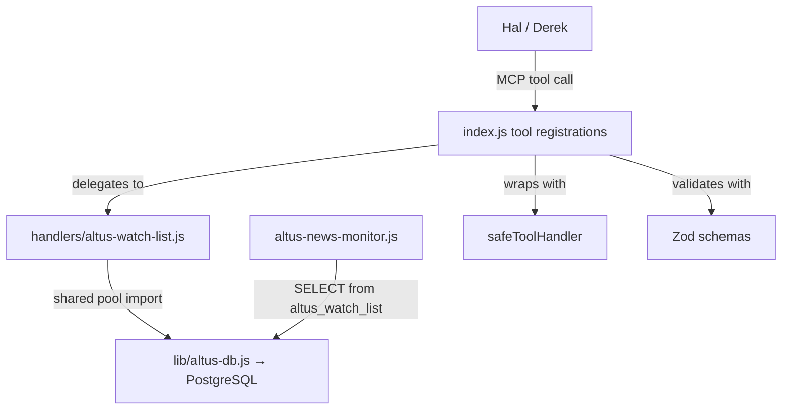

# Design Document: Altus Watch List

## Overview

The watch list feature adds a self-contained CRUD module to the Altus MCP server that lets Derek manage a list of artists and topics tracked by the news monitor cron. The existing `getNewsOpportunities` function in `altus-news-monitor.js` already queries `altus_watch_list WHERE active = true` and gracefully handles the table's absence — once this feature creates and populates the table, cross-referencing activates automatically with zero changes to the news monitor.

The feature introduces:
- One new PostgreSQL table (`altus_watch_list`) with case-preserved names and application-level case-insensitive duplicate detection
- One new handler module (`handlers/altus-watch-list.js`) exporting `initWatchListSchema`, `addWatchSubject`, `removeWatchSubject`, and `listWatchSubjects`
- Three new MCP tools registered in `index.js`: `altus_add_watch_subject`, `altus_remove_watch_subject`, `altus_list_watch_subjects`
- A schema init call added to the existing `DATABASE_URL` startup block in `index.js`

No existing handlers, cron logic, or dependencies are modified.

## Architecture

The watch list follows the same layered pattern as the review tracker:



Key architectural decisions:

1. **Handler module pattern** — All business logic lives in `handlers/altus-watch-list.js`. Tool registrations in `index.js` handle only TEST_MODE/DATABASE_URL guards and delegation. This mirrors `review-tracker-handler.js`.

2. **Shared pool** — The handler imports `pool` from `lib/altus-db.js`. No new connection pools.

3. **Application-level duplicate detection** — Rather than a database-level case-insensitive unique constraint (which would require `citext` extension or a functional unique index), the handler performs a pre-insert `LOWER(name)` check. The database `UNIQUE` constraint on `name` catches exact-case duplicates as a safety net, while the application layer catches case-insensitive duplicates with a friendly error message including the existing row's ID and name.

4. **Soft delete** — Remove sets `active = false` rather than deleting rows, preserving historical data and matching the news monitor's `WHERE active = true` filter.

5. **No modification to existing code** — The news monitor already handles the table's absence gracefully. Once the table exists and is populated, cross-referencing activates automatically.

## Components and Interfaces

### Handler Module: `handlers/altus-watch-list.js`

```javascript
// Exports:
export async function initWatchListSchema()
export async function addWatchSubject({ name, notes })
export async function removeWatchSubject({ id, name })
export async function listWatchSubjects({ include_inactive })
```

#### `initWatchListSchema()`
- Creates `altus_watch_list` table using `CREATE TABLE IF NOT EXISTS`
- Creates `idx_altus_watch_list_active` index using `CREATE INDEX IF NOT EXISTS`
- Called at startup in `index.js` when `DATABASE_URL` is set
- Uses the shared `pool` directly (no client checkout needed for simple DDL)

#### `addWatchSubject({ name, notes })`
- Performs pre-insert duplicate check: `SELECT id, name FROM altus_watch_list WHERE LOWER(name) = LOWER($1)`
- If duplicate found (active or inactive), returns `{ error: 'duplicate', existing_id, existing_name }`
- Otherwise inserts and returns the created row: `{ subject: { id, name, active, added_at, notes } }`

#### `removeWatchSubject({ id, name })`
- Validates at least one of `id` or `name` is provided
- If `id` provided: `UPDATE altus_watch_list SET active = false WHERE id = $1 AND active = true RETURNING *`
- If `name` provided: `UPDATE altus_watch_list SET active = false WHERE name ILIKE $1 AND active = true RETURNING *`
- Returns `{ deactivated_count, subjects }` or `{ deactivated_count: 0, subjects: [], note: 'No matching active subjects found' }`

#### `listWatchSubjects({ include_inactive })`
- When `include_inactive` is true: `SELECT * FROM altus_watch_list ORDER BY active DESC, added_at DESC`
- When false/omitted: `SELECT * FROM altus_watch_list WHERE active = true ORDER BY added_at DESC`
- Returns `{ subjects, total, active_count }`

### Tool Registrations in `index.js`

Three tools registered using `server.registerTool()` with Zod input schemas and `safeToolHandler()` wrapper. Each tool follows the established pattern:

1. TEST_MODE check → return mock data
2. DATABASE_URL check → return error if missing
3. Delegate to handler function
4. Wrap result in MCP content format

### Import additions to `index.js`

```javascript
import {
  initWatchListSchema,
  addWatchSubject,
  removeWatchSubject,
  listWatchSubjects,
} from './handlers/altus-watch-list.js';
```

### Schema init addition to `index.js`

```javascript
// Inside the existing `if (process.env.DATABASE_URL)` block:
initWatchListSchema().catch((err) => {
  logger.error('Watch list schema init failed', { error: err.message });
});
```

## Data Models

### Table: `altus_watch_list`

| Column | Type | Constraints | Description |
|--------|------|-------------|-------------|
| `id` | SERIAL | PRIMARY KEY | Auto-incrementing row ID |
| `name` | TEXT | NOT NULL, UNIQUE | Artist or topic name, stored as-provided (case-preserved) |
| `active` | BOOLEAN | NOT NULL, DEFAULT TRUE | Soft-delete flag; `false` = deactivated |
| `added_at` | TIMESTAMPTZ | DEFAULT NOW() | Timestamp when the subject was added |
| `notes` | TEXT | nullable | Optional context, e.g. "touring in summer 2026" |

### Indexes

| Index Name | Column(s) | Purpose |
|------------|-----------|---------|
| `idx_altus_watch_list_active` | `active` | Efficient filtering for the news monitor's `WHERE active = true` query |

### DDL

```sql
CREATE TABLE IF NOT EXISTS altus_watch_list (
  id        SERIAL PRIMARY KEY,
  name      TEXT NOT NULL UNIQUE,
  active    BOOLEAN NOT NULL DEFAULT TRUE,
  added_at  TIMESTAMPTZ DEFAULT NOW(),
  notes     TEXT
);

CREATE INDEX IF NOT EXISTS idx_altus_watch_list_active
  ON altus_watch_list (active);
```


## Correctness Properties

*A property is a characteristic or behavior that should hold true across all valid executions of a system — essentially, a formal statement about what the system should do. Properties serve as the bridge between human-readable specifications and machine-verifiable correctness guarantees.*

### Property 1: Add subject round-trip preserves data

*For any* valid non-empty name string and any optional notes string, calling `addWatchSubject({ name, notes })` should return a subject where `name` is byte-identical to the input, `notes` matches the input (or is null if omitted), `active` is `true`, `id` is a positive integer, and `added_at` is a valid timestamp.

**Validates: Requirements 2.1, 3.1, 3.2**

### Property 2: Case-insensitive duplicate rejection

*For any* name string and any case variation of that string (e.g., uppercased, lowercased, mixed), adding the original name then attempting to add the case variation should fail with a duplicate error containing `existing_id` (matching the first insert's id) and the original `name` as stored, without inserting a new row.

**Validates: Requirements 2.2, 2.3, 3.3**

### Property 3: Soft delete preserves row with active=false

*For any* active watch subject, calling `removeWatchSubject` (by id or name) should set `active = false` on the matching row rather than deleting it, and the response should include `deactivated_count` equal to the number of deactivated rows and a `subjects` array containing the deactivated records.

**Validates: Requirements 4.1, 4.6**

### Property 4: Remove by name uses case-insensitive matching

*For any* active watch subject with a given name, calling `removeWatchSubject({ name: variation })` where `variation` is any case permutation of the original name should successfully deactivate the subject.

**Validates: Requirements 4.4**

### Property 5: Remove by id matches exactly

*For any* active watch subject, calling `removeWatchSubject({ id })` with the subject's id should deactivate exactly that one subject and no others.

**Validates: Requirements 4.5**

### Property 6: List filter correctness

*For any* set of watch subjects where some are active and some are deactivated, `listWatchSubjects({ include_inactive: false })` should return only active subjects, and `listWatchSubjects({ include_inactive: true })` should return all subjects (both active and inactive).

**Validates: Requirements 5.2, 5.3, 5.4**

### Property 7: List counts consistency

*For any* response from `listWatchSubjects`, `total` should equal `subjects.length`, and `active_count` should equal the number of subjects in the response where `active === true`.

**Validates: Requirements 5.5**

### Property 8: List ordering

*For any* set of watch subjects, `listWatchSubjects({ include_inactive: true })` should return subjects ordered by `active` descending (active first) then by `added_at` descending (newest first within each group).

**Validates: Requirements 5.1**

## Error Handling

| Scenario | Handler Response | Tool Response |
|----------|-----------------|---------------|
| Case-insensitive duplicate on add | `{ error: 'duplicate', existing_id: <id>, existing_name: '<name>' }` | Wrapped in MCP content |
| Neither `id` nor `name` on remove | `{ error: 'Either id or name must be provided' }` | Wrapped in MCP content |
| No matching active subject on remove | `{ deactivated_count: 0, subjects: [], note: 'No matching active subjects found' }` | Wrapped in MCP content |
| Empty watch list on list | `{ subjects: [], total: 0, active_count: 0 }` | Wrapped in MCP content |
| `TEST_MODE=true` | Mock data returned | No DB interaction |
| `DATABASE_URL` not set | `{ error: 'Database not configured' }` | No DB interaction |
| Unexpected exception | Caught by `safeToolHandler` | `{ success: false, exit_reason: 'tool_error' }` |
| Database constraint violation (exact-case duplicate bypassing app check) | PostgreSQL UNIQUE violation propagates | Caught by `safeToolHandler` |

All handler functions are pure business logic — they never throw intentionally. Errors are returned as structured objects. The `safeToolHandler` wrapper in `index.js` catches any unexpected exceptions.

## Testing Strategy

### Unit Tests (`tests/altus-watch-list.unit.test.js`)

Example-based tests using Vitest with a mocked `pool`:

- **Add subject** — verify INSERT query is called with correct parameters, verify response shape
- **Add duplicate** — mock SELECT to return existing row, verify error response with `existing_id` and `existing_name`
- **Remove by id** — verify UPDATE query sets `active = false` with correct WHERE clause
- **Remove by name** — verify ILIKE matching in UPDATE query
- **Remove with neither id nor name** — verify error response
- **Remove with no match** — mock UPDATE returning 0 rows, verify `deactivated_count: 0` response
- **List active only** — verify WHERE clause includes `active = true`
- **List with inactive** — verify no active filter in query
- **List empty** — verify `{ subjects: [], total: 0, active_count: 0 }` response
- **TEST_MODE intercepts** — verify each tool returns mock data when `TEST_MODE=true`
- **DATABASE_URL guard** — verify each tool returns error when `DATABASE_URL` is unset

### Property-Based Tests (`tests/altus-watch-list.property.test.js`)

Using `fast-check` with minimum 100 iterations per property. Each test references its design document property.

Properties 1–8 from the Correctness Properties section are implemented as property-based tests against the handler functions with a real (test) database or appropriately mocked pool that simulates PostgreSQL behavior.

Tag format: `// Feature: altus-watch-list, Property N: <property title>`

Key generators:
- **Name generator**: `fc.string({ minLength: 1, maxLength: 200 })` filtered to exclude empty/whitespace-only strings
- **Notes generator**: `fc.option(fc.string({ maxLength: 500 }))`
- **Case variation generator**: For a given string, randomly apply `.toUpperCase()`, `.toLowerCase()`, or mixed-case transformation

### Integration Tests

- Schema init idempotency — call `initWatchListSchema()` twice, verify no errors
- Full add → list → remove → list cycle against a test database
- Verify `altus-news-monitor.js` can query `altus_watch_list` after schema init (existing behavior, no code changes needed)
