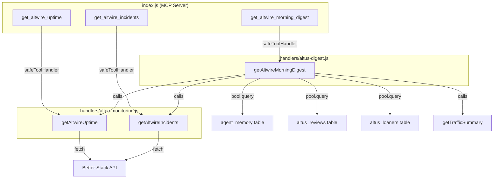

# Design Document: Morning Digest & Monitoring

## Overview

This feature adds three new MCP tools to the altwire-altus service:

1. **`get_altwire_uptime`** — Fetches live status of AltWire's two Better Stack monitors (site and wp_cron).
2. **`get_altwire_incidents`** — Fetches open incidents on those monitors.
3. **`get_altwire_morning_digest`** — Aggregates a daily briefing from 7 data sources into a single response.

The tools follow the existing altwire-altus patterns: ESM modules, `safeToolHandler` wrapping, `TEST_MODE` guards, and graceful degradation on missing credentials. The digest uses `Promise.allSettled` so that individual source failures never block the overall briefing.

Two new handler files are created. Three existing files are modified. No existing handler or library files are touched.

## Architecture



The digest handler imports the monitoring functions directly rather than going through the MCP tool layer. This avoids the overhead of MCP serialization for internal calls and keeps the dependency graph simple.

### Request Flow

1. MCP request arrives at `index.js` → `createMcpServer()` routes to the registered tool.
2. `safeToolHandler` wraps the call — any uncaught exception becomes a structured `{ exit_reason: 'tool_error' }` response.
3. For uptime/incidents: the monitoring handler checks `TEST_MODE`, then `BETTER_STACK_TOKEN`, then makes `fetch()` calls to Better Stack.
4. For the digest: the digest handler checks `TEST_MODE`, then fires all 7 data fetches via `Promise.allSettled`, maps results into sections, and returns the aggregate.

## Components and Interfaces

### handlers/altus-monitoring.js

**Exports:**

```javascript
export async function getAltwireUptime()    → { site: {...}, wp_cron: {...} } | { error: string }
export async function getAltwireIncidents() → { site: [...], wp_cron: [...] } | { error: string }
```

**Constants:**

```javascript
const BETTER_STACK_BASE = 'https://uptime.betterstack.com/api/v2';
const MONITORS = {
  site:    '1881007',
  wp_cron: '2836297',
};
```

**getAltwireUptime():**
- Guard: `TEST_MODE === 'true'` → return canned response with `test_mode: true`.
- Guard: `!BETTER_STACK_TOKEN` → return `{ error: 'BETTER_STACK_TOKEN not configured' }`.
- Fetch `GET /monitors/1881007` and `GET /monitors/2836297` in parallel via `Promise.all`.
- Map each response to `{ status, last_checked_at, url }`.
- On fetch failure: return `{ error: <reason> }` — never throw.

**getAltwireIncidents():**
- Same guards as uptime.
- Fetch `GET /incidents?monitor_id={id}&resolved=false&per_page=5` for each monitor in parallel.
- Map each incident to `{ name, started_at, cause }`.
- Empty incident list → empty array for that monitor key.
- On fetch failure: return `{ error: <reason> }` — never throw.

### handlers/altus-digest.js

**Exports:**

```javascript
export async function getAltwireMorningDigest() → { date, generated_at, uptime, incidents, news_alerts, story_opportunities, review_deadlines, overdue_loaners, traffic }
```

**Imports:**

```javascript
import pool from '../lib/altus-db.js';
import { logger } from '../logger.js';
import { getAltwireUptime, getAltwireIncidents } from './altus-monitoring.js';
import { getTrafficSummary } from './altwire-matomo-client.js';
```

**getAltwireMorningDigest():**
- Guard: `TEST_MODE === 'true'` → return canned digest with `test_mode: true`.
- Derive `today` using `new Date().toLocaleDateString('en-CA', { timeZone: 'America/New_York' })`.
- Fire all 7 fetches via `Promise.allSettled`:
  1. `getAltwireUptime()`
  2. `getAltwireIncidents()`
  3. `pool.query(...)` for `agent_memory` key `altus:news_alert:{today}`
  4. `pool.query(...)` for `agent_memory` key `altus:story_opportunities:{today}`
  5. `pool.query(...)` for `altus_reviews` — due within 7 days, not published/cancelled
  6. `pool.query(...)` for `altus_loaners` — overdue, not returned/kept/lost
  7. `getTrafficSummary('day', 'yesterday')`
- For each settled result:
  - `fulfilled` → extract and transform the value into the section data.
  - `rejected` → set section to `null`, add `warning` string describing the failure.
- Agent memory values: parse `value` column as JSON. If no row found, section is `null` with a note.
- Matomo: if the result contains an `error` field, treat as failure (section `null` + warning).
- Return the aggregate object with `date`, `generated_at` (ISO timestamp), and all 7 sections.

### index.js Modifications

Register three new tools using dynamic `await import()`:

```javascript
// Inside createMcpServer(), after existing tool registrations:

// Monitoring & Digest — dynamic import to keep top-level imports clean
const { getAltwireUptime, getAltwireIncidents } = await import('./handlers/altus-monitoring.js');
const { getAltwireMorningDigest } = await import('./handlers/altus-digest.js');

server.registerTool('get_altwire_uptime', { ... }, safeToolHandler(async () => { ... }));
server.registerTool('get_altwire_incidents', { ... }, safeToolHandler(async () => { ... }));
server.registerTool('get_altwire_morning_digest', { ... }, safeToolHandler(async () => { ... }));
```

The `createMcpServer()` function must become `async` (or the dynamic imports must be hoisted) to support `await import()`. Since `createMcpServer()` is called inside an async HTTP handler, making it `async` is the cleanest approach.

**Tool schemas:**
- `get_altwire_uptime` — no input parameters.
- `get_altwire_incidents` — no input parameters.
- `get_altwire_morning_digest` — no input parameters.

### hal-labels.js Modifications

Add three entries to `LABEL_MAP`:

```javascript
get_altwire_uptime: 'Checking site uptime',
get_altwire_incidents: 'Checking open incidents',
get_altwire_morning_digest: 'Generating morning digest',
```

### .env.example Modifications

Add under the "Optional" or a new "Monitoring" section:

```
# Better Stack Monitoring
BETTER_STACK_TOKEN=            # Read-only Better Stack API token for uptime monitoring
```

## Data Models

### Better Stack API Response (Monitor)

```json
{
  "data": {
    "id": "1881007",
    "attributes": {
      "url": "https://altwire.net",
      "status": "up",
      "last_checked_at": "2025-01-15T12:00:00.000Z",
      "pronounceable_name": "AltWire Site"
    }
  }
}
```

### Better Stack API Response (Incidents)

```json
{
  "data": [
    {
      "id": "123",
      "attributes": {
        "name": "HTTP 503",
        "started_at": "2025-01-15T10:00:00.000Z",
        "cause": "HTTP 503 Service Unavailable"
      }
    }
  ]
}
```

### Uptime Response Shape

```json
{
  "site": {
    "status": "up",
    "last_checked_at": "2025-01-15T12:00:00.000Z",
    "url": "https://altwire.net"
  },
  "wp_cron": {
    "status": "up",
    "last_checked_at": "2025-01-15T12:00:00.000Z",
    "url": "https://altwire.net/wp-cron.php"
  }
}
```

### Incidents Response Shape

```json
{
  "site": [
    { "name": "HTTP 503", "started_at": "2025-01-15T10:00:00.000Z", "cause": "HTTP 503 Service Unavailable" }
  ],
  "wp_cron": []
}
```

### Morning Digest Response Shape

```json
{
  "date": "2025-01-15",
  "generated_at": "2025-01-15T14:00:00.000Z",
  "uptime": { "site": { "status": "up", ... }, "wp_cron": { ... } },
  "incidents": { "site": [], "wp_cron": [] },
  "news_alerts": { "news_queries": [...], "watch_list_matches": [...] },
  "story_opportunities": { "opportunities": [...], "pitches": [...], "total_evaluated": 50, "date_range": "...", "cached": true },
  "review_deadlines": { "reviews": [...], "count": 2 },
  "overdue_loaners": { "loaners": [...], "count": 1 },
  "traffic": { "nb_visits": 1234, "nb_uniq_visitors": 890, ... }
}
```

When a section fails:

```json
{
  "uptime": null,
  "uptime_warning": "Better Stack API request failed: 503"
}
```

### agent_memory Table (Existing)

| Column | Type | Notes |
|--------|------|-------|
| agent | TEXT | Always `'altus'` for this feature |
| key | TEXT | e.g. `altus:news_alert:2025-01-15` |
| value | TEXT | JSON-serialized string |
| created_at | TIMESTAMPTZ | |
| updated_at | TIMESTAMPTZ | |

Composite unique key: `(agent, key)`.

### altus_reviews Table (Existing)

Relevant columns for digest query:
- `due_date` DATE — nullable
- `status` TEXT — one of `assigned`, `in_progress`, `submitted`, `editing`, `scheduled`, `published`, `cancelled`

Digest filter: `due_date IS NOT NULL AND due_date <= CURRENT_DATE + 7 days AND status NOT IN ('published', 'cancelled')`.

### altus_loaners Table (Existing)

Relevant columns for digest query:
- `expected_return_date` DATE — nullable
- `actual_return_date` DATE — nullable
- `status` TEXT — one of `out`, `kept`, `returned`, `overdue`, `lost`

Digest filter: `expected_return_date < CURRENT_DATE AND actual_return_date IS NULL AND status NOT IN ('returned', 'kept', 'lost')`.

## Correctness Properties

*A property is a characteristic or behavior that should hold true across all valid executions of a system — essentially, a formal statement about what the system should do. Properties serve as the bridge between human-readable specifications and machine-verifiable correctness guarantees.*

### Property 1: Uptime response mapping preserves required fields

*For any* valid Better Stack monitor API response containing `status`, `last_checked_at`, and `url` attributes, the `getAltwireUptime` function SHALL return an object where both the `site` and `wp_cron` keys contain exactly those three fields with the original values.

**Validates: Requirements 1.3**

### Property 2: Better Stack error handling never throws

*For any* Better Stack handler function (`getAltwireUptime` or `getAltwireIncidents`) and *for any* fetch failure (network error, HTTP 4xx/5xx, malformed JSON), the handler SHALL return an object containing an `error` field and SHALL NOT throw an exception.

**Validates: Requirements 1.5, 2.5**

### Property 3: Incidents response mapping preserves required fields

*For any* array of Better Stack incident objects, each containing `name`, `started_at`, and `cause` attributes, the `getAltwireIncidents` function SHALL return an object where the `site` and `wp_cron` keys each contain an array of incidents with those three fields preserved. When the source array is empty, the corresponding key SHALL contain an empty array.

**Validates: Requirements 2.2, 2.3**

### Property 4: Digest section failure isolation

*For any* subset of the 7 digest data sources that fail (throw, reject, or return error), the morning digest SHALL return `null` with a `warning` string for each failed section, while all non-failed sections SHALL contain their expected data unaffected by the failures.

**Validates: Requirements 3.1, 3.3**

### Property 5: Agent memory value JSON parse round-trip

*For any* JSON-serializable object stored as a string in the `agent_memory` `value` column, the digest handler's parsing step SHALL produce an object equal to the original.

**Validates: Requirements 4.4**

### Property 6: Review deadline filter correctness

*For any* set of review records with varying `due_date` and `status` values, the digest's review deadline query SHALL return exactly those reviews where `due_date` is not null, `due_date` is within 7 days of today, and `status` is not `published` or `cancelled`, ordered by `due_date` ascending.

**Validates: Requirements 5.1, 5.3**

### Property 7: Overdue loaner filter correctness

*For any* set of loaner records with varying `expected_return_date`, `actual_return_date`, and `status` values, the digest's overdue loaner query SHALL return exactly those loaners where `expected_return_date` is before today, `actual_return_date` is null, and `status` is not `returned`, `kept`, or `lost`, ordered by `expected_return_date` ascending.

**Validates: Requirements 5.2, 5.4**

## Error Handling

### Monitoring Handler (altus-monitoring.js)

| Condition | Behavior |
|-----------|----------|
| `TEST_MODE === 'true'` | Return canned response with `test_mode: true`, skip all API calls |
| `BETTER_STACK_TOKEN` missing | Return `{ error: 'BETTER_STACK_TOKEN not configured' }` |
| `fetch()` network error | Catch, return `{ error: <message> }` |
| HTTP non-2xx from Better Stack | Catch, return `{ error: 'Better Stack API error', status: <code> }` |
| Malformed JSON response | Catch, return `{ error: 'Invalid response from Better Stack' }` |

The handler never throws. `safeToolHandler` in `index.js` provides a second safety net for truly unexpected failures.

### Digest Handler (altus-digest.js)

| Condition | Behavior |
|-----------|----------|
| `TEST_MODE === 'true'` | Return canned digest with `test_mode: true`, skip all calls |
| Any section promise rejects | Section value → `null`, add `{section}_warning` field |
| Agent memory key not found | Section value → `null`, note: "No data available for today" |
| Matomo returns `{ error: ... }` | Traffic section → `null`, warning with Matomo error |
| `DATABASE_URL` missing | DB queries will fail → caught by `Promise.allSettled`, sections degrade to `null` |

The digest is designed to always return a response. Even if all 7 sources fail, the response will contain `date`, `generated_at`, and 7 `null` sections with warnings.

## Testing Strategy

### Property-Based Tests (fast-check + vitest)

The project already uses `fast-check` v4.1 and `vitest` v4.1 for property-based testing. Each property test runs a minimum of 100 iterations.

| Test File | Properties Covered |
|-----------|-------------------|
| `tests/monitoring-response-mapping.property.test.js` | Property 1 (uptime mapping), Property 3 (incidents mapping) |
| `tests/monitoring-error-handling.property.test.js` | Property 2 (never throws on error) |
| `tests/digest-section-isolation.property.test.js` | Property 4 (failure isolation) |
| `tests/digest-agent-memory-parse.property.test.js` | Property 5 (JSON parse round-trip) |
| `tests/digest-review-loaner-filter.property.test.js` | Property 6 (review filter), Property 7 (loaner filter) |

**Tag format:** `Feature: morning-digest-monitoring, Property {N}: {title}`

**Approach:**
- Mock `fetch()` with generated Better Stack API responses for monitoring properties.
- Mock `pool.query` and handler imports for digest properties.
- Generate random review/loaner records with varying dates and statuses for filter properties.
- Generate random JSON-serializable objects for the agent memory round-trip property.
- Generate random subsets of failing sections for the isolation property.

### Unit Tests (vitest)

| Test File | Coverage |
|-----------|----------|
| `tests/altus-monitoring.unit.test.js` | TEST_MODE guard, missing token guard, successful responses, label map entries |
| `tests/altus-digest.unit.test.js` | TEST_MODE guard, all-sections-present smoke test, date format, generated_at format, Matomo error propagation |

### What Is NOT Property-Tested

- **TEST_MODE guards** — single-scenario example tests (EXAMPLE classification).
- **Missing token guards** — single-scenario edge case tests (EDGE_CASE classification).
- **Tool registration in index.js** — smoke test verifying tools exist (SMOKE classification).
- **hal-labels.js entries** — example test checking key existence (EXAMPLE classification).
- **ESM conventions, file boundaries** — code review, not runtime tests.
- **Dynamic import() in index.js** — verified by the tool registration smoke test.
